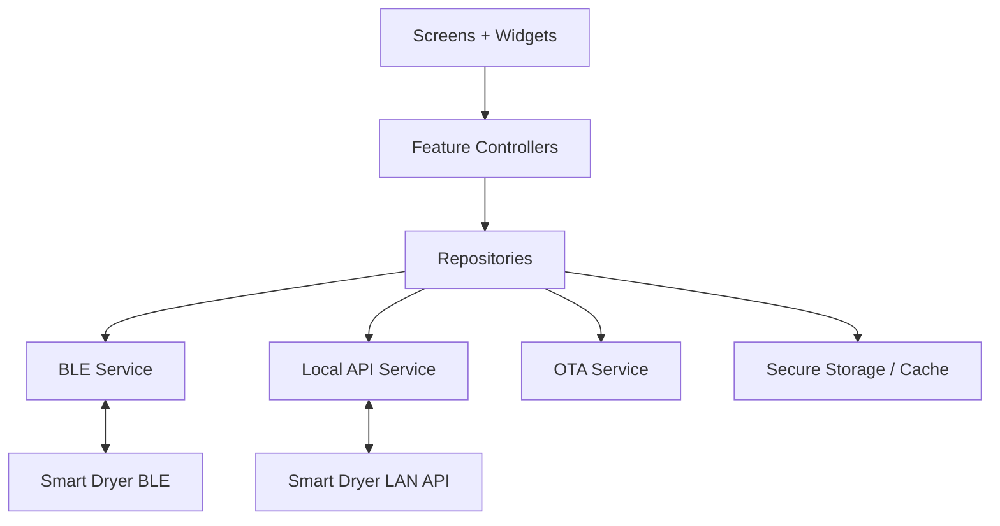

# Mobile Application Architecture

## Platform

- Framework: Flutter.
- Targets: Android and iOS.
- Language: Dart.
- Architecture: feature-first UI plus shared domain and service layers.
- State management: Riverpod-style provider architecture recommended.
- Local communication:
  - BLE for onboarding, provisioning, nearby control, diagnostics, and recovery.
  - WiFi LAN HTTP API for local control, status, and OTA.

## App Responsibilities

- Discover devices over BLE.
- Pair with device.
- Provision WiFi credentials over BLE.
- Display live device status.
- Start/stop drying programs.
- Configure timers.
- Show hygiene refresh workflow.
- Show diagnostics and fault history.
- Trigger OTA updates and show progress.
- Operate without mandatory cloud account.

## Architecture Diagram



## Folder Structure

```text
smart_dryer_app/
  pubspec.yaml
  lib/
    main.dart
    app/
      app.dart
      app_routes.dart
      app_theme.dart
    domain/
      models/
      repositories/
    services/
      ble/
      local_api/
      ota/
      storage/
    features/
      splash/
      onboarding/
      home/
      device_control/
      programs/
      timer/
      hygiene/
      settings/
      diagnostics/
      firmware_update/
    shared/
      widgets/
      utils/
  test/
```

## Data Flow

1. UI sends user intent to feature controller/repository.
2. Repository chooses BLE or LAN path depending on availability.
3. Command is sent to firmware.
4. Firmware status is decoded into domain model.
5. UI updates from domain state.

## Security Notes

- BLE pairing is required before privileged control.
- WiFi credentials should be sent only over paired BLE sessions.
- LAN API should add per-device authorization token before production release.
- OTA URL should come from trusted app/server metadata, not arbitrary user input in production.

## Phase 10 Scope

This phase creates the app structure, models, route skeleton, and service abstractions. Phase 11 will refine UI/UX, screen composition, visual design, and interaction details.

