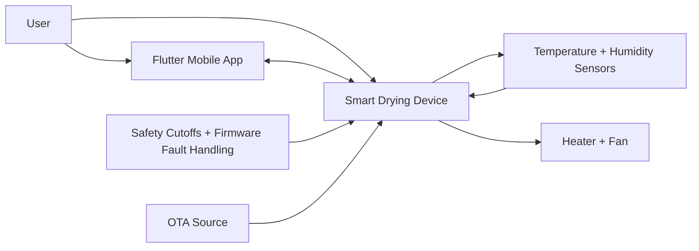

# Product Requirements Document

## Product Name

Smart Drying & Hygiene System

## Product Summary

The Smart Drying & Hygiene System is a consumer IoT appliance for drying and hygienically refreshing shoes, helmets, gloves, technical gear, sports equipment, and clothing. The system combines controlled airflow, regulated heat, temperature and humidity sensing, safety cutoffs, local intelligence, Bluetooth onboarding/control, WiFi connectivity, and OTA firmware updates.

This product is intended for real consumer production, not a lab prototype. Requirements therefore prioritize safety, repeatability, manufacturability, serviceability, firmware recovery, and predictable user experience.

## Target Users

- Athletes drying sports shoes, gloves, pads, and helmets after training.
- Outdoor workers drying boots, gloves, jackets, and helmets.
- Motorcyclists and cyclists drying helmets, gloves, and riding gear.
- Families drying shoes and clothing accessories.
- Rental, gym, and locker-room operators who need repeatable drying cycles.

## Target Use Environments

- Indoor residential laundry areas, utility rooms, entryways, garages, and mudrooms.
- Light commercial spaces such as gyms, rental counters, lockers, and equipment rooms.
- Ambient operating range: 5 C to 35 C.
- Relative humidity operating range: 20% RH to 85% RH non-condensing.
- Storage range: -10 C to 50 C.

## Product Scope

### Included

- Controlled warm-air drying.
- Hygiene refresh mode using elevated but consumer-safe air temperatures.
- Humidity-based cycle control.
- Manual program selection.
- App-based control over BLE and WiFi.
- Local operation without cloud dependency.
- OTA firmware update support.
- Fault detection, watchdogs, and thermal safety layers.
- Manufacturing-ready architecture baseline.

### Excluded From Initial Release

- Cloud AI recommendations.
- UV-C sterilization.
- Ozone generation.
- Steam generation.
- Medical-grade disinfection claims.
- Operation with dripping-wet items.
- Outdoor exposed operation.

## Product Positioning

The product should be positioned as a premium smart drying and hygiene appliance. It should avoid medical sterilization claims unless later validated by certified microbiology testing. The initial claim language should use terms such as "drying", "odor reduction support", "hygiene refresh", and "moisture management".

## Functional Requirements

| ID | Requirement | Priority | Acceptance Criteria |
| --- | --- | --- | --- |
| FR-001 | The system shall support drying cycles for shoes, helmets, gloves, sports gear, technical gear, and clothing accessories. | Must | User can select item category from device or mobile app. |
| FR-002 | The system shall regulate heater output based on measured air temperature. | Must | Temperature remains within selected program band during steady-state operation. |
| FR-003 | The system shall measure relative humidity in the drying airflow. | Must | Firmware receives valid humidity readings at least once every 5 seconds during active cycles. |
| FR-004 | The system shall support humidity-based auto stop. | Must | Cycle completes when humidity drop rate and absolute humidity threshold indicate dry state. |
| FR-005 | The system shall support manual timed drying. | Must | User can select duration from 15 minutes to 8 hours. |
| FR-006 | The system shall support fan speed control. | Must | Firmware can command at least low, medium, high, and max airflow levels. |
| FR-007 | The system shall support a hygiene refresh cycle. | Must | System runs a controlled elevated-temperature cycle within safety limits. |
| FR-008 | The system shall support cooldown after heated cycles. | Must | Heater turns off and fan continues until outlet temperature is below cooldown threshold or timeout expires. |
| FR-009 | The system shall expose local controls over BLE. | Must | App can pair, read status, start/stop cycle, and configure program over BLE. |
| FR-010 | The system shall expose WiFi support for local network control and OTA. | Must | Device can join a configured 2.4 GHz WiFi network and check for OTA firmware. |
| FR-011 | The system shall support OTA firmware update with rollback. | Must | Device can recover to previous firmware if new firmware fails validation. |
| FR-012 | The system shall report faults to the app. | Must | App displays fault code, severity, and suggested user action. |
| FR-013 | The system shall preserve essential cycle state through brief power interruption where safe. | Should | Device resumes only if safety checks pass after reboot. |
| FR-014 | The system shall support factory reset. | Must | User can clear pairing, WiFi credentials, and stored settings. |
| FR-015 | The system shall maintain local operation when internet is unavailable. | Must | BLE control and onboard cycle execution remain available without cloud access. |

## Non-Functional Requirements

| ID | Requirement | Target |
| --- | --- | --- |
| NFR-001 | Product lifetime | Minimum 5 years consumer use. |
| NFR-002 | Active cycle noise | Target below 55 dBA at 1 m in normal mode, below 62 dBA in max mode. |
| NFR-003 | App responsiveness | Control changes reflected in device status within 2 seconds over BLE or LAN under normal conditions. |
| NFR-004 | Firmware boot time | Ready for local control within 5 seconds of power-on, excluding safety self-test delays. |
| NFR-005 | OTA reliability | Failed OTA shall not brick the device. |
| NFR-006 | Data privacy | Product shall function without requiring cloud account creation. |
| NFR-007 | Manufacturing testability | PCB shall expose programming, power, ground, UART, and key test points. |
| NFR-008 | Service diagnostics | Device shall store recent fault history in non-volatile memory. |
| NFR-009 | Regulatory design | Hardware shall be designed for CE, FCC, RoHS, and applicable appliance safety preparation. |
| NFR-010 | Maintainability | Firmware modules shall be separated by function with clear interfaces. |

## Drying And Hygiene Performance Targets

### Temperature Bands

| Mode | Target Outlet Air Temperature | Hard Firmware Limit | Use Case |
| --- | --- | --- | --- |
| Delicate | 35 C to 40 C | 45 C | Technical fabrics, gloves, delicate gear. |
| Standard Dry | 42 C to 50 C | 55 C | Shoes, helmets, sports pads, general gear. |
| Heavy Dry | 50 C to 58 C | 62 C | Boots, dense gloves, wet sports equipment. |
| Hygiene Refresh | 58 C to 65 C | 70 C | Odor reduction support and hygiene refresh. |
| Cooldown | Ambient to 35 C | Heater disabled | Safe handling after heated cycle. |

The hygiene mode is not specified as sterilization. Later microbiology testing is required before making antimicrobial or pathogen-reduction claims.

### Humidity Control Strategy

- Measure relative humidity and temperature in the return or exhaust airflow.
- Estimate drying progress from humidity trend, elapsed time, selected item type, and fan/heater profile.
- Use a two-stage drying strategy:
  - Bulk drying: higher airflow and controlled heat while humidity is high.
  - Finish drying: lower heat or pulsed heat when humidity approaches dry threshold.
- Stop automatically when:
  - Exhaust relative humidity remains below program threshold for a configured hold time.
  - Humidity drop rate flattens and outlet temperature remains stable.
  - Maximum cycle time is reached.
- Fail safe if humidity sensor is unavailable:
  - Continue only in timed mode at conservative temperature.
  - Disable adaptive completion estimate.
  - Report degraded sensor status.

### Fan Airflow Requirements

| Mode | Target Airflow Per Outlet | System Target | Notes |
| --- | --- | --- | --- |
| Low | 5 to 10 CFM | 10 to 25 CFM | Quiet drying, delicate gear. |
| Medium | 10 to 18 CFM | 25 to 45 CFM | Standard cycles. |
| High | 18 to 30 CFM | 45 to 70 CFM | Shoes, gloves, helmets. |
| Max | 30+ CFM where enclosure supports it | 70+ CFM | Short boost periods and heavy loads. |

Airflow targets must be validated after duct, nozzle, filter, and enclosure losses are known. Firmware shall support closed-loop or table-driven fan control depending on fan tachometer availability.

### Power Requirements

| Subsystem | Target |
| --- | --- |
| AC input option | 100 VAC to 240 VAC, 50/60 Hz, region-specific plug and safety certification path. |
| Heater power | Initial target 300 W to 800 W depending on product size and enclosure thermal design. |
| Fan power | 5 W to 40 W depending on fan topology. |
| Logic power | 3.3 V rail for ESP32-S3 and sensors. |
| Auxiliary power | 5 V or 12 V rail as required by fan, relay, drivers, display, or LEDs. |
| Standby power | Target below 0.5 W where regulatory program requirements apply. |

Initial recommended architecture is an isolated AC-DC supply for control electronics and a separately protected heater load. Heater topology will be selected in Phase 3 after region, enclosure, power class, and certification strategy are approved.

## Product Programs

| Program | Duration Range | Temperature | Fan | Auto Stop |
| --- | --- | --- | --- | --- |
| Shoes | 30 min to 4 hr | Standard/Heavy | Medium/High | Yes |
| Helmet | 20 min to 2 hr | Delicate/Standard | Medium | Yes |
| Gloves | 30 min to 3 hr | Delicate/Standard | Medium/High | Yes |
| Sports Gear | 45 min to 6 hr | Standard/Heavy | High | Yes |
| Technical Gear | 30 min to 4 hr | Delicate | Low/Medium | Yes |
| Clothing Accessory | 30 min to 5 hr | Delicate/Standard | Medium | Yes |
| Hygiene Refresh | 20 min to 90 min | Hygiene | Medium/High | Time and safety limited |
| Fan Only | 15 min to 8 hr | Heater off | Low to Max | Optional |

## Mobile App Requirements

- Flutter single codebase for Android and iOS.
- BLE onboarding and local control.
- WiFi provisioning.
- Program selection and active cycle monitoring.
- Firmware update workflow.
- Diagnostics view with clear fault explanations.
- No mandatory cloud login in initial release.
- Accessibility support for text scaling, contrast, and screen readers.

## Connectivity Requirements

### BLE

- Used for onboarding, nearby control, provisioning, status, diagnostics, and recovery support.
- BLE shall remain available when WiFi is not configured.
- Pairing security shall prevent unauthorized local control.

### WiFi

- 2.4 GHz WiFi support.
- Used for LAN control, OTA update checks, and future cloud integration.
- Device shall retain local schedule and safety behavior independent of WiFi.

## Data Requirements

### Stored On Device

- Device identity and firmware version.
- User-selected defaults.
- WiFi credentials in secure storage.
- BLE pairing information.
- Recent cycle history summary.
- Recent fault log.
- OTA state.

### Stored In App

- Paired device list.
- Friendly device names.
- User preferences.
- Last-known status.
- Firmware update metadata cache.

## Reliability Requirements

- Heater shall default off on reset, firmware crash, watchdog reset, sensor fault, overtemperature fault, and fan failure.
- Active control loops shall run on a deterministic schedule.
- Watchdog shall supervise main application tasks.
- Non-volatile writes shall be rate limited to avoid flash wear.
- Device shall tolerate interrupted OTA update.
- Faults shall be classified as recoverable, user-serviceable, or service-required.

## Manufacturing Requirements

- PCB shall include programming and test pads suitable for bed-of-nails fixture.
- PCB shall include unique serial number programming support.
- Design shall support automated end-of-line test.
- BOM shall prefer components with stable lifecycle and second-source options where practical.
- High-voltage and low-voltage domains shall be clearly separated.
- Enclosure shall prevent user access to live conductors and hot surfaces.
- Assembly shall support poka-yoke connectors where possible.
- Product label shall include rated voltage, power, serial number, regulatory marks, and warnings.

## Preliminary Cost Targets

These are planning estimates only and must be refined in Phase 3 after component selection.

| Item | Estimated Cost Range at 1k Units |
| --- | --- |
| ESP32-S3 module | USD 3.50 to 7.00 |
| Temperature/humidity sensor | USD 1.50 to 5.00 |
| Isolated AC-DC supply | USD 3.00 to 9.00 |
| Fan | USD 5.00 to 20.00 |
| Heater assembly | USD 6.00 to 25.00 |
| Power switching and protection | USD 3.00 to 12.00 |
| PCB and assembly | USD 6.00 to 20.00 |
| Enclosure and ducts | USD 15.00 to 60.00 |
| Harnesses, connectors, labels | USD 3.00 to 12.00 |
| Packaging | USD 3.00 to 10.00 |
| Total preliminary BOM | USD 49.00 to 180.00 |

Retail price target should be determined after industrial design, power class, channel margin, warranty reserve, certification cost, and tooling budget are known.

## Phase 1 Architecture Context

## Open Product Decisions For Approval

- Final product size and number of drying outlets.
- Maximum heater power class.
- AC mains regions for first launch.
- Whether the first release includes physical buttons, display, or app-only control plus basic status LEDs.
- Whether fan tachometer feedback is mandatory.
- Whether commercial fleet mode is in scope for initial release.

