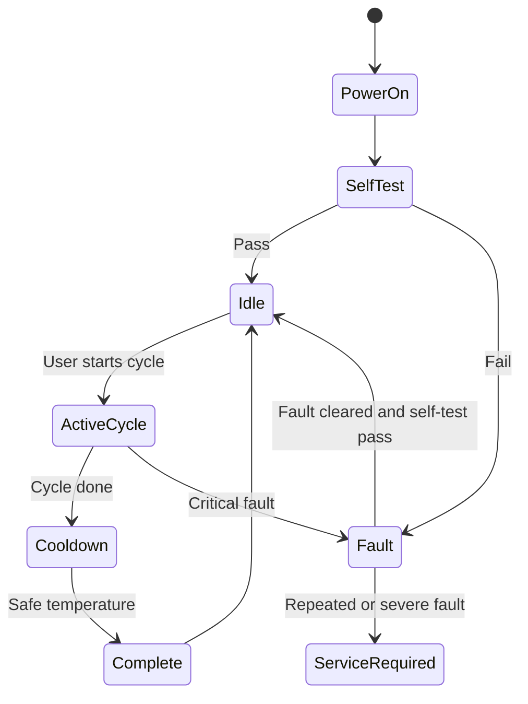

# Safety Requirements

## Safety Philosophy

The appliance shall fail safe. Any uncertain condition that could lead to unsafe heating shall disable the heater. The fan may continue only when it reduces risk and does not create a separate hazard.

Safety shall be layered across mechanical design, electrical design, firmware, sensors, watchdogs, thermal cutoffs, manufacturing tests, and user instructions.

## Safety-Critical Hazards

| ID | Hazard | Possible Cause | Required Mitigation |
| --- | --- | --- | --- |
| HZ-001 | Overtemperature air output | Firmware fault, blocked airflow, heater stuck on, sensor error | Thermal fuse/cutoff, independent temperature sensing, firmware limit, watchdog, heater-default-off design. |
| HZ-002 | Fire risk | Heater fault, dust buildup, flammable material misuse | Flame-retardant materials, inlet filtering strategy, max temperature limits, user warnings, abnormal-operation testing. |
| HZ-003 | Electric shock | AC mains exposure, insulation failure, liquid ingress | Certified isolated supply, enclosure barriers, creepage/clearance, strain relief, fuse, protective layout rules. |
| HZ-004 | Gear damage | Excess heat for delicate materials | Program-specific temperature caps and conservative default modes. |
| HZ-005 | Fan failure while heater is active | Fan motor fault, obstruction, connector failure | Tachometer or current monitoring where feasible, temperature rise detection, heater shutdown. |
| HZ-006 | Sensor failure | Disconnected, stale, saturated, invalid reading | Plausibility checks, redundant safety threshold, degraded mode or heater lockout. |
| HZ-007 | Firmware hang | Deadlock, memory fault, task crash | Hardware/software watchdog and heater off on reset. |
| HZ-008 | OTA corruption | Power loss or invalid image | Signed or integrity-checked OTA, rollback partition, recovery path. |
| HZ-009 | Unauthorized control | Unpaired BLE client, LAN abuse | Secure pairing, authenticated commands, local authorization model. |
| HZ-010 | Hot surface/contact discomfort | Outlet ducts or gear become too hot | Surface temperature limits, cooldown cycle, material selection, warning labels. |

## Mandatory Safety Requirements

| ID | Requirement | Acceptance Criteria |
| --- | --- | --- |
| SR-001 | Heater shall default to off after reset, boot, crash, watchdog event, or brownout. | Hardware and firmware review confirms no reset state can energize heater unintentionally. |
| SR-002 | A non-firmware thermal cutoff shall interrupt heater power under abnormal temperature. | Thermal cutoff rating selected in Phase 3 and validated during thermal testing. |
| SR-003 | Firmware shall enforce program temperature limits. | Heater output is reduced or disabled before hard limit is exceeded. |
| SR-004 | Firmware shall enforce an absolute overtemperature limit. | Heater is disabled and fault latched if outlet or heater-zone temperature exceeds limit. |
| SR-005 | Active heated operation shall require valid temperature sensing. | Heater cannot start if critical temperature sensor is missing, stale, or invalid. |
| SR-006 | Heated operation shall require confirmed fan operation or conservative airflow validation. | Heater is disabled if fan command and airflow/fan feedback are inconsistent. |
| SR-007 | Device shall enter cooldown after heated cycles. | Heater remains off and fan runs until safe temperature or timeout. |
| SR-008 | Maximum cycle duration shall be enforced. | No heated cycle can run indefinitely. |
| SR-009 | Watchdog shall supervise safety-critical firmware tasks. | Watchdog reset occurs if control task becomes unresponsive. |
| SR-010 | OTA shall not disable safety checks. | New firmware must pass boot validation before being marked valid. |
| SR-011 | Faults shall be reported clearly. | App displays actionable user message for each production fault code. |
| SR-012 | High-voltage and low-voltage PCB domains shall meet creepage and clearance requirements for target market. | PCB design review checks applicable spacing rules before fabrication. |
| SR-013 | Product enclosure shall prevent user access to live parts. | Mechanical design passes tool-access and finger-probe review. |
| SR-014 | Materials near heater shall be rated for expected temperature plus margin. | Material datasheets support thermal and flame rating requirements. |
| SR-015 | The appliance shall not make medical sterilization claims without validation. | Marketing, app text, packaging, and manuals avoid unsupported claims. |

## Safety Operating Limits

| Limit | Value |
| --- | --- |
| Maximum normal outlet air temperature | 65 C in Hygiene Refresh. |
| Firmware hard outlet limit | 70 C. |
| Heater disabled threshold | To be finalized after heater-zone sensor placement; initial planning target 75 C to 90 C local heater-zone depending on geometry. |
| Mechanical thermal cutoff | To be finalized in Phase 3; must be independent of ESP32-S3 firmware. |
| Maximum heated cycle | 8 hours absolute maximum, lower per program. |
| Cooldown exit target | Outlet air below 35 C or near ambient plus validated margin. |

## Fault Classes

| Class | Meaning | Device Behavior |
| --- | --- | --- |
| Advisory | Non-critical issue. | Continue if safe, notify user. |
| Recoverable | Temporary issue that can clear after condition improves. | Pause or stop heater, allow restart after checks pass. |
| Latched Safety Fault | Potentially unsafe condition. | Heater disabled until user action or power cycle plus self-test. |
| Service Required | Hardware fault likely. | Disable heated operation until service or factory reset flow if appropriate. |

## Required Fault Detection

- Overtemperature.
- Temperature sensor disconnected or invalid.
- Humidity sensor disconnected or invalid.
- Fan not spinning or airflow inadequate.
- Heater command mismatch where detectable.
- Brownout or unstable supply.
- Watchdog reset during active cycle.
- OTA validation failure.
- Non-volatile storage corruption.
- Repeated unexpected resets.
- BLE or WiFi command authorization failure.

## Safety State Diagram

## User-Facing Safety Behaviors

- App shall show "Cooling down" before "Complete" after heated operation.
- App shall avoid encouraging users to dry dripping-wet items.
- App shall warn users not to block air inlets or outlets.
- App shall recommend delicate mode for heat-sensitive materials.
- Device shall visibly indicate active heating, cooldown, complete, and fault states.

## Manufacturing Safety Checks

End-of-line manufacturing test shall verify:

- Firmware version and hardware revision.
- ESP32-S3 boot and flash integrity.
- Temperature/humidity sensor communication.
- Fan drive command and feedback where available.
- Heater control signal path without energizing unsafe full-power heat during basic PCB test.
- Protective input fuse presence or continuity where testable.
- Ground isolation and high-pot tests at appliance assembly level.
- BLE advertising and provisioning mode.
- WiFi radio basic function.
- Fault indicator output.

## Certification Preparation

The design shall be prepared for:

- CE EMC and safety review.
- FCC intentional radiator and unintentional radiator requirements.
- RoHS material compliance.
- Applicable household appliance safety standards based on final product classification and target sales regions.

Formal certification strategy must be confirmed with a qualified compliance lab before production tooling.

