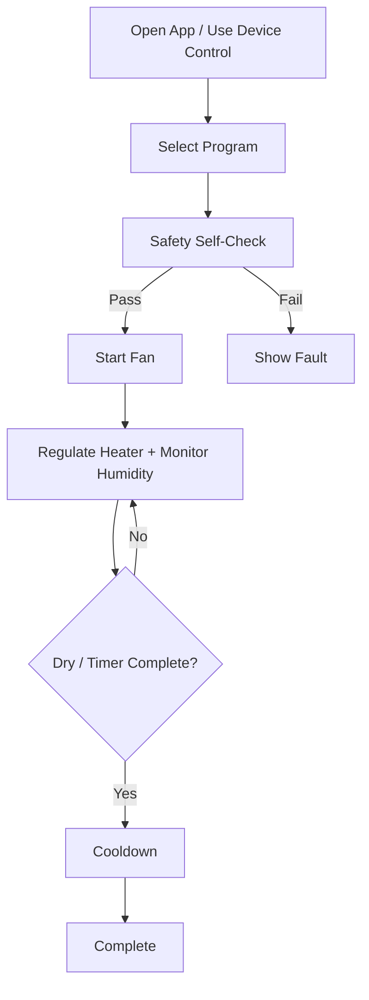

# User Stories

## Consumer User Stories

| ID | User Story | Acceptance Criteria |
| --- | --- | --- |
| US-001 | As a user, I want to dry wet shoes after exercise so they are ready for the next day. | User selects Shoes program, starts cycle, and receives complete notification. |
| US-002 | As a user, I want the dryer to stop automatically when my gear is dry so I do not waste energy. | Device stops when humidity-based completion criteria are met. |
| US-003 | As a user, I want a gentle mode for technical fabrics so expensive gear is not damaged. | Delicate program uses reduced temperature and conservative fan/heater behavior. |
| US-004 | As a user, I want a hygiene refresh option for gloves and helmets so odor is reduced after use. | Hygiene Refresh program runs elevated-temperature cycle within safety limits. |
| US-005 | As a user, I want to check progress from my phone. | App shows active state, elapsed time, remaining estimate, temperature, humidity, and fan level. |
| US-006 | As a user, I want the product to be safe if I forget it is running. | System enforces maximum cycle time, thermal limits, cooldown, and fault shutdown. |
| US-007 | As a user, I want to use the product even when WiFi is down. | BLE and onboard controls still allow core operation. |
| US-008 | As a user, I want clear error messages instead of cryptic fault codes. | App maps fault code to cause, severity, and recommended action. |
| US-009 | As a user, I want firmware updates to be simple and safe. | App can trigger update, show progress, and device recovers if update fails. |
| US-010 | As a user, I want the product to cool down before I handle gear. | Heated cycles enter cooldown before complete state. |

## Setup And Ownership Stories

| ID | User Story | Acceptance Criteria |
| --- | --- | --- |
| US-011 | As a first-time owner, I want onboarding to be fast. | App discovers device over BLE and completes setup with guided steps. |
| US-012 | As a user, I want to name my device. | App stores and displays friendly device name. |
| US-013 | As a user, I want to connect the device to WiFi for updates. | App provisions 2.4 GHz WiFi credentials securely over BLE. |
| US-014 | As a user, I want to reset the device before selling or gifting it. | Factory reset clears pairings, WiFi credentials, and local preferences. |
| US-015 | As a household user, I want multiple phones to control the device safely. | Device supports controlled pairing flow and does not allow unauthorized control. |

## Advanced User Stories

| ID | User Story | Acceptance Criteria |
| --- | --- | --- |
| US-016 | As a user, I want fan-only mode for gear that should not be heated. | User can disable heater and select fan speed and duration. |
| US-017 | As a user, I want to customize cycle duration. | User can set timer within allowed range for selected program. |
| US-018 | As a user, I want drying recommendations based on gear type. | App suggests temperature and fan profile from selected item. |
| US-019 | As a user, I want to see whether humidity is falling. | App displays simple drying progress indicator derived from humidity trend. |
| US-020 | As a user, I want the device to warn me when a sensor needs service. | Device reports sensor fault, stale data, or out-of-range readings. |

## Service And Manufacturing Stories

| ID | User Story | Acceptance Criteria |
| --- | --- | --- |
| US-021 | As a manufacturing technician, I want to program and test the PCB quickly. | PCB exposes programming and test pads for fixture access. |
| US-022 | As a manufacturing technician, I want pass/fail end-of-line test results. | Firmware provides factory test mode with sensor, heater-drive, fan-drive, and communication checks. |
| US-023 | As a support technician, I want fault history. | Device stores recent fault events with timestamps or cycle-relative timing. |
| US-024 | As a product engineer, I want firmware version tracking. | App and diagnostics report firmware version, hardware revision, and boot partition state. |
| US-025 | As a quality engineer, I want thermal tests to prove safe behavior. | Product test plan includes blocked airflow, fan failure, sensor failure, and overtemperature scenarios. |

## Core Use Cases

### Use Case 1: Start A Standard Drying Cycle

1. User opens app or presses onboard control.
2. User selects item category.
3. Device performs safety self-check.
4. Fan starts.
5. Heater ramps to target band.
6. Device monitors temperature and humidity.
7. Device adapts cycle based on humidity trend.
8. Device enters cooldown.
9. Device reports complete.

### Use Case 2: Hygiene Refresh

1. User selects Hygiene Refresh.
2. App displays non-medical hygiene-refresh language.
3. Device confirms fan and sensor readiness.
4. Heater ramps to hygiene band.
5. Device limits duration and temperature.
6. Device enters cooldown.
7. App reports completion and cycle summary.

### Use Case 3: Fault During Active Cycle

1. Device detects overtemperature, fan failure, sensor fault, or watchdog event.
2. Heater is disabled.
3. Fan continues if safe and useful.
4. Fault is latched when required.
5. App and onboard indicator show fault.
6. User receives recommended action.

### Use Case 4: OTA Update

1. App or device discovers available firmware.
2. User approves update.
3. Device downloads and verifies firmware.
4. Device boots new firmware in pending validation mode.
5. New firmware self-validates.
6. Device marks firmware valid or rolls back.

## User Flow Diagram

