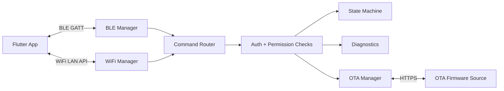
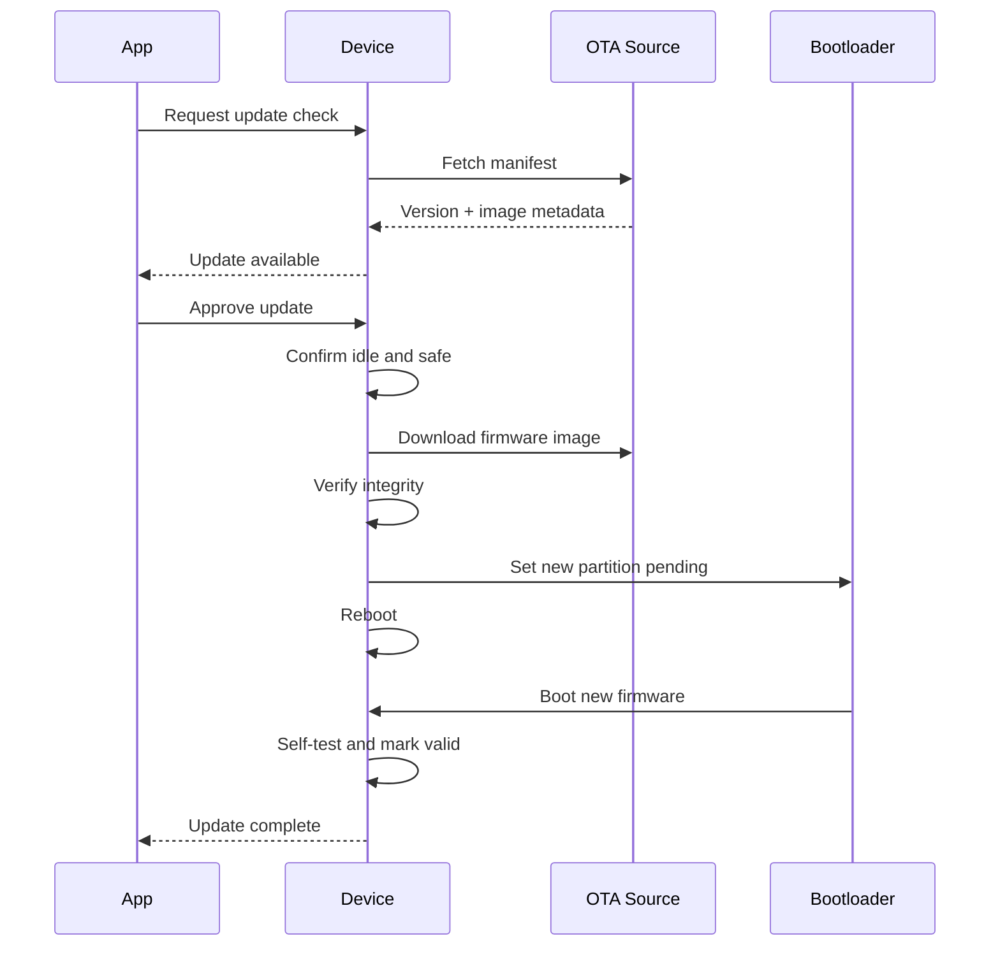
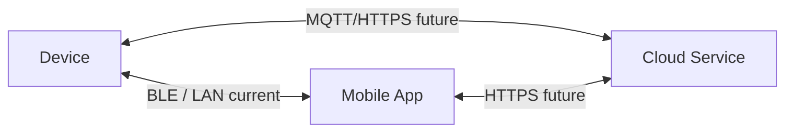

# Connectivity And OTA Architecture

## Connectivity Summary

The device supports two local communication paths:

- BLE for onboarding, nearby control, provisioning, diagnostics, and recovery.
- WiFi for local network control, OTA updates, and optional future cloud integration.

BLE and WiFi commands are normalized through the firmware command router so behavior is consistent regardless of transport.

## Connectivity Diagram

## BLE Roles

| Role | Purpose |
| --- | --- |
| Provisioning | Discover unclaimed device, pair, name device, provision WiFi. |
| Nearby control | Start/stop cycles and view live status. |
| Diagnostics | Read firmware version, fault log, and sensor status. |
| Recovery | Restore WiFi settings or trigger safe recovery workflow. |

## WiFi Roles

| Role | Purpose |
| --- | --- |
| Local control | Control and monitor device on same LAN. |
| OTA | Download signed or integrity-verified firmware images. |
| Time sync | Optional time source for logs and scheduling. |
| Future cloud | Optional telemetry or remote control with user consent. |

## OTA Architecture

## OTA Safety Requirements

- OTA cannot begin during active drying, hygiene, preheat, or cooldown.
- Heater must be off before update starts.
- Device must reject firmware with invalid integrity metadata.
- Device must use rollback-capable partitioning.
- New firmware must mark itself valid only after core self-tests pass.
- BLE recovery path should remain available after WiFi configuration failure.

## Version Model

Firmware version shall include:

- Semantic version, such as `1.2.0`.
- Build number or commit identifier.
- Hardware compatibility range.
- Minimum app version if required.
- Release channel, such as production, beta, or factory.

## Future Cloud Architecture

Cloud integration is optional and deferred. If added, it should not become a dependency for safe operation.

Future cloud functions may include:

- Remote status with user consent.
- Fleet diagnostics for commercial customers.
- Firmware rollout management.
- Anonymous reliability telemetry.

Cloud shall not directly bypass local safety controls. The device firmware remains the authority for all heater and fan decisions.

