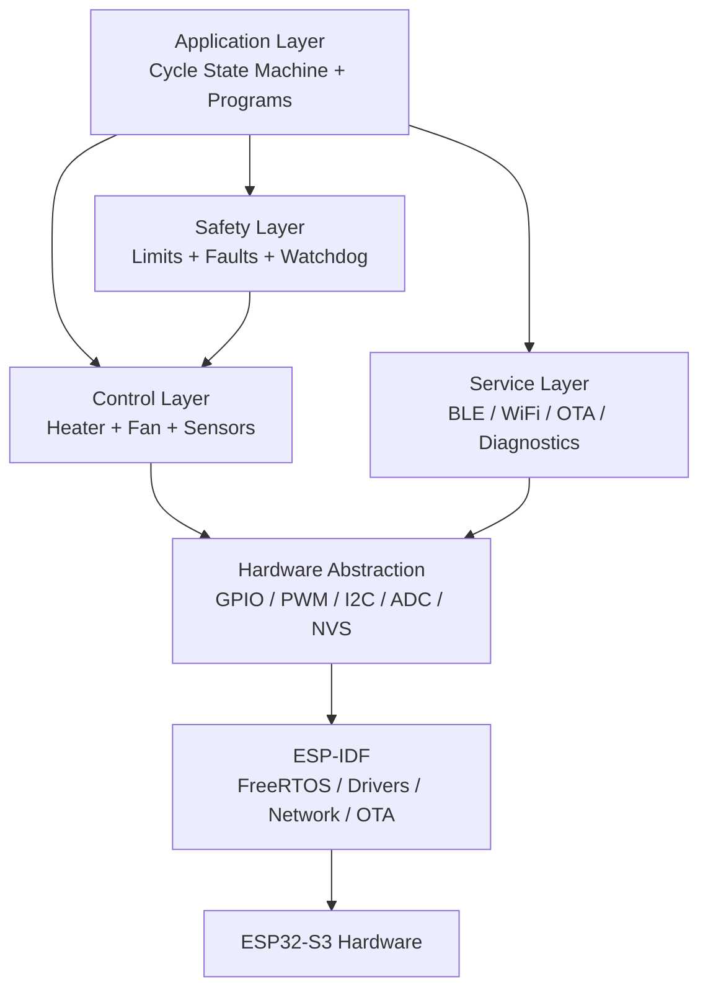
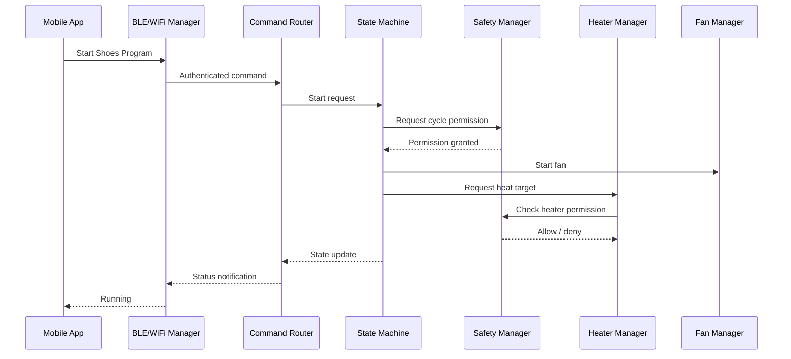
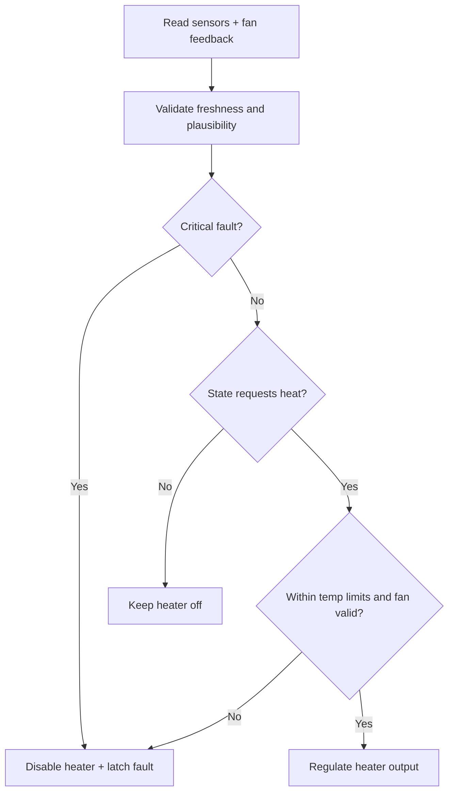

# Firmware Architecture

## Firmware Platform

- Framework: ESP-IDF.
- MCU: ESP32-S3.
- Language: C or C++ using ESP-IDF conventions.
- RTOS: FreeRTOS through ESP-IDF.
- Storage: NVS for settings, fault history, pairing state, OTA state.
- Connectivity: ESP-IDF BLE stack and WiFi stack.
- OTA: ESP-IDF OTA partitions with rollback support.

## Firmware Layer Diagram



## Firmware Modules

| Module | Responsibility |
| --- | --- |
| main_app | Boot sequence, module initialization, task creation. |
| state_machine | Owns operating state, program transitions, cycle timing. |
| program_profiles | Defines drying and hygiene profiles. |
| sensor_manager | Reads, filters, validates temperature and humidity sensors. |
| heater_manager | Controls heater output and enforces local heater constraints. |
| fan_manager | Controls fan speed and validates feedback. |
| safety_manager | Evaluates faults, grants/denies heater permission, latches critical faults. |
| ble_manager | BLE services, characteristics, pairing, command exchange. |
| wifi_manager | WiFi provisioning, station mode, reconnection, local network services. |
| ota_manager | Firmware update, versioning, validation, rollback. |
| diagnostics_manager | Fault log, cycle history, manufacturing diagnostics. |
| storage_manager | NVS settings, credentials handles, fault persistence. |
| command_router | Normalizes BLE/WiFi/factory commands into internal requests. |
| factory_test | End-of-line test commands and hardware checks. |
| watchdog_manager | Task health supervision and watchdog feeding. |

## Task Model

| Task | Cadence / Trigger | Notes |
| --- | --- | --- |
| control_task | 1 Hz or faster | Reads sensors, updates safety, heater, and fan. |
| state_task | 1 Hz | Updates cycle state, timers, program logic. |
| connectivity_task | Event-driven | Handles BLE/WiFi command events. |
| ota_task | Event-driven | Runs only when update requested and cycle inactive. |
| diagnostics_task | 1 Hz to 10 Hz plus events | Stores faults and publishes status. |
| factory_task | Command-driven | Enabled only in factory mode. |

## Firmware Command Flow



## Safety Control Loop



## State Ownership Rules

- Only the state machine changes operating state.
- Only the safety manager decides whether heater operation is permitted.
- Heater manager may apply stricter local shutdown but may not override safety denial.
- Connectivity modules never directly control GPIO outputs.
- OTA manager may request maintenance mode but cannot run during active heated cycles.

## Diagnostics Model

Each fault record shall include:

- Fault code.
- Fault class.
- Operating state.
- Program type.
- Temperature and humidity snapshot.
- Fan command and feedback snapshot.
- Uptime or real-time timestamp when available.
- Firmware version and reset reason.

## Firmware Package Structure

```text
firmware/
  CMakeLists.txt
  sdkconfig.defaults
  partitions.csv
  main/
    app_main.c
    app_config.h
  components/
    state_machine/
    program_profiles/
    sensor_manager/
    heater_manager/
    fan_manager/
    safety_manager/
    ble_manager/
    wifi_manager/
    ota_manager/
    diagnostics_manager/
    storage_manager/
    command_router/
    watchdog_manager/
    factory_test/
  tests/
    unit/
    integration/
```

## Firmware Safety Defaults

- GPIOs controlling heater are configured to inactive state at boot.
- Heater manager initializes after sensor manager and safety manager.
- A cycle cannot start until self-test passes.
- Sensor stale timeout disables heat.
- Fan feedback failure disables heat during heated programs.
- Critical fault persists through reboot until cleared by valid flow.

