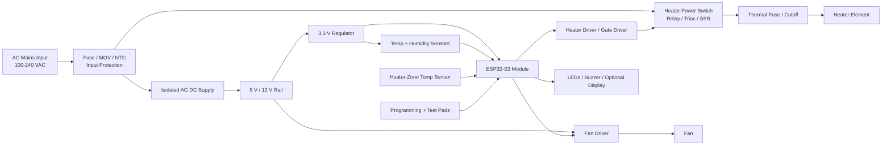
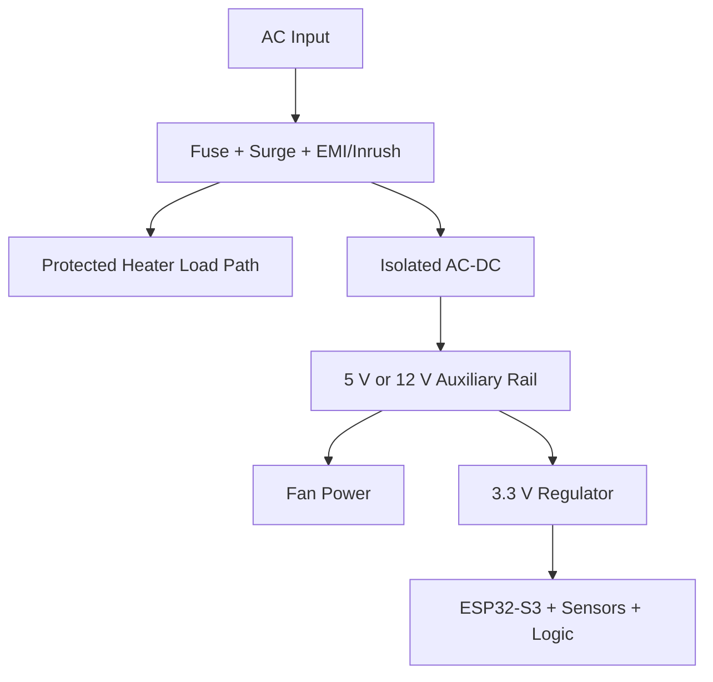
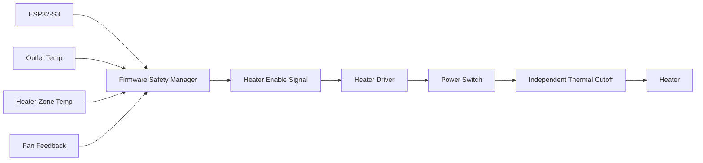

# Hardware Architecture

## Hardware Block Diagram

## Hardware Subsystems

| Subsystem | Design Intent |
| --- | --- |
| AC input protection | Fuse, surge suppression, inrush management, and safe line filtering as required by certification. |
| Isolated power supply | Certified AC-DC module or supply stage for low-voltage electronics. |
| ESP32-S3 control | Main controller with BLE, WiFi, non-volatile settings, OTA, and safety logic. |
| Sensor interface | Digital temperature/humidity sensor in airflow plus heater-zone temperature monitoring. |
| Heater switching | Fail-safe heater power control using selected topology after Phase 3 risk analysis. |
| Fan drive | PWM-capable fan drive with tachometer or current/airflow inference where feasible. |
| Independent cutoff | Thermal fuse or resettable thermal protector placed near heater risk zone. |
| User indicators | Minimal onboard state indication for power, active cycle, complete, and fault. |
| Factory interface | UART/JTAG/programming pads, test points, and fixture access. |

## Power Architecture

## Initial Rail Plan

| Rail | Purpose | Notes |
| --- | --- | --- |
| AC mains | Heater input and AC-DC supply input. | Region-specific safety design required. |
| 12 V or 5 V | Fan, indicators, drivers, optional relays. | Final fan choice determines voltage. |
| 3.3 V | ESP32-S3, sensors, logic IO. | Low-noise local decoupling required. |

## Sensor Placement Strategy

- Outlet or exhaust airflow temperature sensor: primary control temperature.
- Humidity sensor: placed in airflow path but shielded from direct heater radiation and condensation.
- Heater-zone temperature sensor: abnormal condition detection near heater assembly.
- Optional inlet temperature sensor: improves humidity estimation and ambient compensation.

## Actuator Strategy

### Heater

- Heater must be electrically impossible to energize accidentally during reset if practical.
- Firmware output shall require deliberate enable path.
- Independent thermal cutoff shall interrupt heater power under abnormal condition.
- Heater control topology to be selected in Phase 3:
  - Relay for simple on/off lower switching frequency.
  - Triac/SSR for AC heater modulation.
  - MOSFET for DC heater architecture.

### Fan

- PWM control preferred.
- Tachometer feedback strongly preferred for safety and diagnostics.
- If tachometer is unavailable, firmware shall infer failure from current sense, temperature rise, or airflow/humidity behavior, but this is weaker and should be treated as a risk.

## Safety Hardware Architecture

## PCB Partitioning

- High-voltage AC section.
- Heater switching section.
- Isolated low-voltage power section.
- ESP32-S3 RF/control section.
- Sensor connector section.
- Fan/actuator connector section.
- Factory programming/test section.

## Layout Principles For Later PCB Phase

- Maintain high-voltage and low-voltage creepage/clearance with slots if needed.
- Keep ESP32-S3 antenna area free of copper and tall metal parts per module guidance.
- Place decoupling capacitors close to each IC power pin.
- Route sensor lines away from heater switching noise.
- Use wide traces or copper pours for heater/fan currents.
- Use star or partitioned grounding strategy for noisy power returns and quiet sensor logic.
- Add ESD protection on external connectors and user-accessible interfaces.

## Hardware Interfaces

| Interface | Direction | Purpose |
| --- | --- | --- |
| I2C | ESP32-S3 to sensors | Temperature/humidity readings. |
| ADC | Sensor to ESP32-S3 | Optional analog heater-zone temp or current sense. |
| PWM | ESP32-S3 to fan | Fan speed control. |
| GPIO/tach | Fan to ESP32-S3 | Fan speed feedback. |
| GPIO/PWM | ESP32-S3 to heater driver | Heater enable or modulation. |
| UART/JTAG/USB | Factory to ESP32-S3 | Programming and diagnostics. |
| GPIO | ESP32-S3 to LEDs/buzzer | Local status. |

## Manufacturing Architecture

- Factory firmware mode accessible through fixture command.
- Bed-of-nails pads for power, ground, UART, boot, reset, and selected IO.
- Serial number and hardware revision programmed during test.
- Sensor calibration offset storage if required by final sensor choice.
- Heater full-power test should occur only at appliance assembly level with thermal controls in place.

