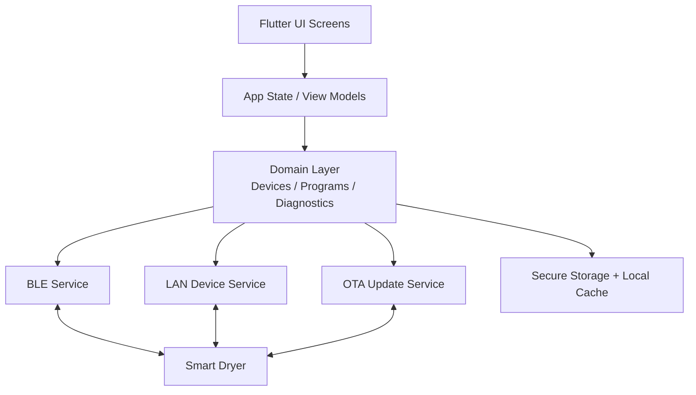
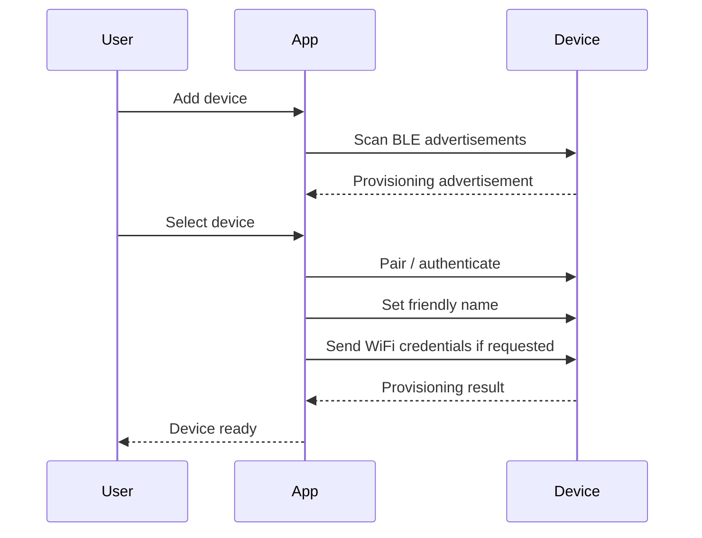
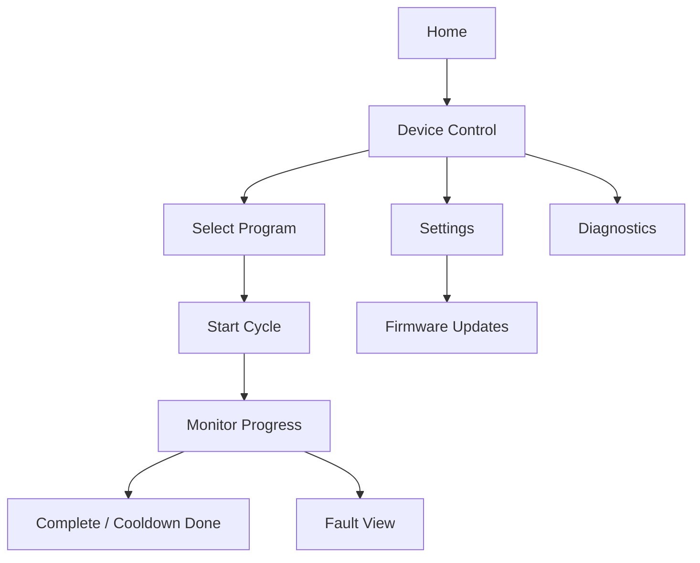

# Mobile Architecture

## Platform

- Framework: Flutter.
- Targets: Android and iOS.
- Architecture: Feature-first modules with shared domain services.
- State management: Riverpod, Bloc, or equivalent production-grade pattern to be selected in Phase 10. Initial recommendation is Riverpod for testability and clear dependency injection.
- Connectivity: BLE for onboarding/control and WiFi/LAN for local control and OTA workflow.

## Mobile App Architecture



## Mobile Feature Areas

| Feature | Responsibility |
| --- | --- |
| Splash | App boot, device cache loading, permission checks. |
| Onboarding | BLE discovery, pairing, device naming, WiFi provisioning. |
| Home | Device list and selected device status. |
| Device Control | Start/stop cycle, live status, fan, temperature, humidity. |
| Programs | Item-specific drying profiles and custom settings. |
| Timer | Manual duration selection. |
| Hygiene | Hygiene refresh workflow and safety language. |
| Settings | Device name, WiFi, units, factory reset, app preferences. |
| Diagnostics | Fault history, sensor status, firmware/hardware version. |
| Firmware Updates | Update availability, release notes, progress, rollback status. |

## Mobile Data Model

| Model | Key Fields |
| --- | --- |
| Device | id, name, BLE address/id, LAN address, firmware version, hardware revision. |
| DeviceStatus | state, program, elapsed, remaining estimate, temperature, humidity, fan level, heater status. |
| ProgramProfile | id, name, temperature band, fan range, max duration, auto-stop enabled. |
| FaultRecord | code, severity, description, timestamp, recommended action. |
| OtaInfo | current version, available version, required update flag, progress, rollback status. |

## BLE-First Onboarding Flow



## Runtime Control Flow



## Mobile Safety Rules

- App cannot override firmware safety limits.
- App shall display cooldown as an active safety state.
- App shall block OTA update while a cycle is running.
- App shall present hygiene mode as hygiene refresh, not sterilization.
- App shall require explicit confirmation for factory reset.
- App shall show critical faults prominently with recommended actions.

## Permissions

| Platform | Permission Area |
| --- | --- |
| Android | Bluetooth scan/connect, nearby devices, location where OS requires it for BLE scan, local network if needed. |
| iOS | Bluetooth, local network access where applicable. |

## Mobile Project Structure

```text
mobile_app/
  lib/
    main.dart
    app/
      router.dart
      theme.dart
    features/
      onboarding/
      home/
      device_control/
      programs/
      timer/
      hygiene/
      settings/
      diagnostics/
      firmware_update/
    domain/
      models/
      repositories/
      use_cases/
    services/
      ble/
      lan/
      ota/
      storage/
    shared/
      widgets/
      utils/
  test/
  integration_test/
```

