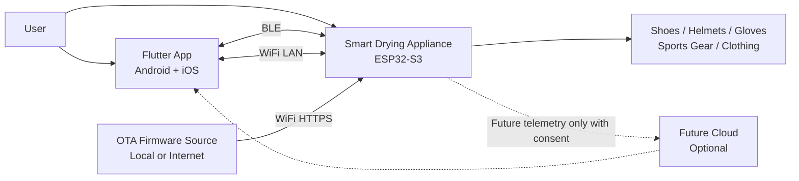
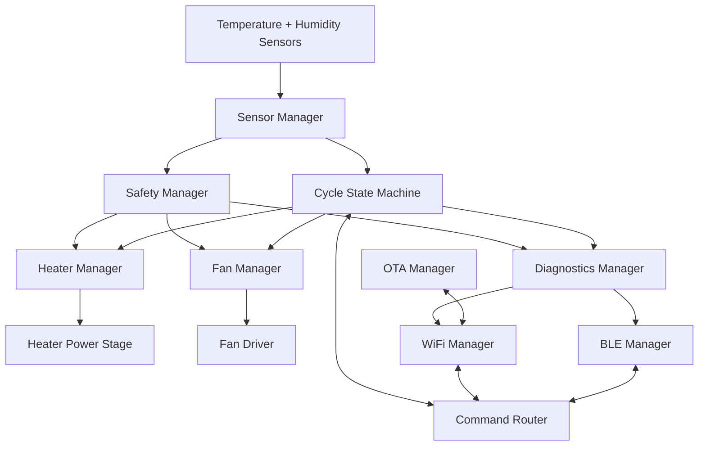
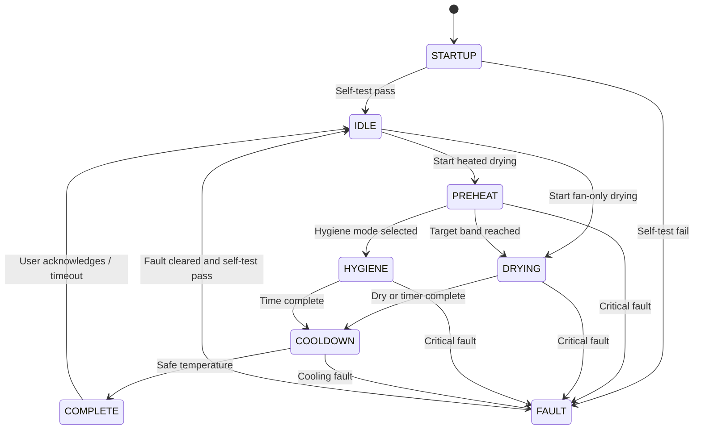

# System Architecture

## Architecture Summary

The Smart Drying & Hygiene System is a locally intelligent connected appliance built around an ESP32-S3 controller. The device regulates heater power and fan airflow using temperature and humidity feedback, exposes control through BLE and WiFi, supports OTA firmware update with rollback, and uses layered safety protections so the heater cannot remain active during unsafe or unknown conditions.

The architecture is intentionally local-first. Cloud integration is optional and deferred. Core drying, hygiene refresh, safety supervision, diagnostics, BLE control, WiFi local control, and OTA recovery must operate without a cloud dependency.

## System Context

## Product Subsystems

| Subsystem | Responsibility |
| --- | --- |
| Power subsystem | Converts AC input to isolated low-voltage rails and safely switches heater/fan loads. |
| Control subsystem | ESP32-S3 executes drying logic, communications, OTA, diagnostics, and safety supervision. |
| Sensor subsystem | Measures air temperature and humidity for control and fault detection. |
| Actuator subsystem | Drives heater and fan using controlled outputs with fail-safe defaults. |
| Safety subsystem | Provides independent thermal cutoff, firmware fault detection, watchdog, and protected power switching. |
| Connectivity subsystem | Provides BLE control/provisioning and WiFi local control/OTA. |
| Mobile app | Provides onboarding, control, monitoring, diagnostics, settings, and firmware update flow. |
| Manufacturing subsystem | Supports programming, calibration, functional test, and serial-number provisioning. |

## System Data Flow

## Control Philosophy

- The heater is permission-based: it turns on only when the state machine requests heat and the safety manager grants permission.
- The fan starts before heater activation in heated cycles.
- Temperature control uses closed-loop regulation around program-specific outlet air targets.
- Humidity control determines drying progress and supports auto-stop.
- Hygiene refresh uses elevated but limited temperature and time, with careful claim language.
- Critical faults override user commands and force heater-off behavior.
- Reset, watchdog, and brownout states return heater drive to off.

## Operating States

| State | Purpose |
| --- | --- |
| IDLE | Device is ready, heater off, fan off unless ventilation is requested. |
| STARTUP | Boot, self-test, configuration loading, safety validation. |
| PREHEAT | Fan on, heater ramps toward target temperature. |
| DRYING | Main drying cycle with humidity-based adaptation. |
| HYGIENE | Elevated-temperature hygiene refresh cycle. |
| COOLDOWN | Heater off, fan continues until safe handling temperature or timeout. |
| COMPLETE | Cycle finished and safe for user interaction. |
| FAULT | Heater disabled and fault reporting active. |

## Top-Level State Diagram

## Architecture Boundaries

- Firmware decides cycle execution and safety behavior.
- Mobile app requests actions but does not directly control heater timing or safety limits.
- BLE and WiFi commands use the same internal command model.
- OTA update is isolated from active drying. Heated cycles cannot continue during firmware update.
- Cloud, if added later, must use the same command authorization rules as local control.

## Security Principles

- BLE pairing required for privileged commands.
- WiFi local API requires authenticated session or signed command token.
- OTA image integrity verification is mandatory.
- WiFi credentials stored in ESP32 secure non-volatile storage.
- Debug interfaces disabled or locked in production firmware.

## Phase 2 Decisions

- Use ESP32-S3 as the central controller with BLE and WiFi.
- Keep cloud optional and out of the safety loop.
- Use a command-router pattern so BLE, WiFi, and future cloud share behavior.
- Enforce safety through a dedicated firmware safety manager plus independent hardware cutoff.
- Prepare the architecture for factory test mode from the beginning.

