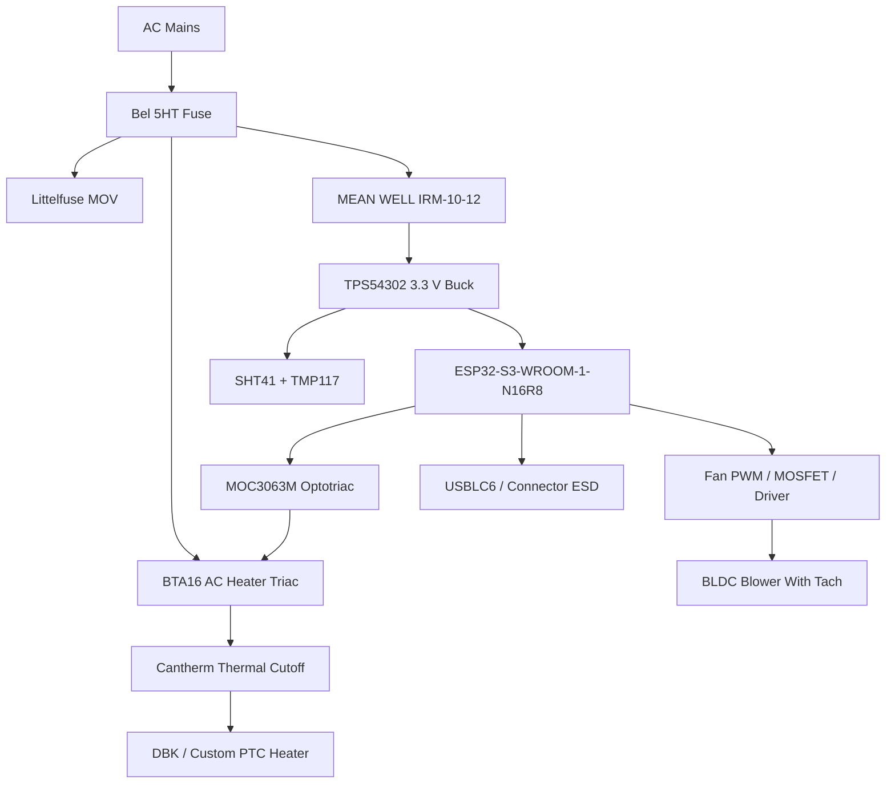

# Component Selection

## Selection Summary

This phase defines the first production-intent electronics baseline. The design uses an ESP32-S3 module for wireless control, digital I2C sensing for humidity and temperature, a separate high-accuracy heater-zone temperature sensor, a certified AC-DC power module, a synchronous buck regulator for the 3.3 V logic rail, optically isolated AC heater switching, fan feedback, and layered input/ESD/thermal protection.

Prices are planning estimates in USD as of 2026-05-30. They must be rechecked through authorized distributors before purchase orders, EVT builds, and mass production.

## Recommended Baseline Components

| Function | Recommended Part | Manufacturer | Est. Unit Cost | Datasheet / Source | Reason For Selection |
| --- | --- | --- | --- | --- | --- |
| MCU / wireless module | ESP32-S3-WROOM-1-N16R8 | Espressif | USD 4.50 to 7.00 | https://documentation.espressif.com/esp32-s3-wroom-1_wroom-1u_datasheet_en.pdf | Integrated WiFi + BLE 5, 16 MB flash, 8 MB PSRAM, mature ESP-IDF support, module certification path, enough memory for OTA, BLE, WiFi, diagnostics, and future UI features. |
| Humidity + outlet air temperature | SHT41-AD1B-R2 | Sensirion | USD 1.94 to 2.95 | https://sensirion.com/products/catalog/SHT41 | Accurate digital humidity/temperature sensor, I2C interface, small package, strong vendor reputation, good fit for humidity-based auto-stop. |
| Heater-zone temperature | TMP117AIDRVR | Texas Instruments | USD 2.50 to 5.00 | https://www.ti.com/product/TMP117 | High-accuracy digital temperature sensor with I2C/SMBus interface, useful as a separate heater-zone safety sensor. |
| Isolated AC-DC power | IRM-10-12 | MEAN WELL | USD 5.00 to 9.00 | https://www.meanwell.com/Upload/PDF/IRM-10/IRM-10-SPEC.PDF | Certified PCB-mount 12 V isolated supply, simplifies safety and compliance compared with custom offline supply. |
| 3.3 V buck regulator | TPS54302DDCR | Texas Instruments | USD 0.65 to 1.33 | https://www.ti.com/product/TPS54302 | 4.5 V to 28 V input, 3 A synchronous buck, good margin for ESP32-S3 WiFi current bursts, efficient from 12 V to 3.3 V. |
| Optional low-noise 3.3 V LDO for sensors | AP2112K-3.3TRG1 | Diodes Inc. | USD 0.10 to 0.40 | https://www.diodes.com/part/view/AP2112 | Low-cost LDO for isolating sensor rail if buck noise affects measurement stability. Use only if thermal budget is acceptable. |
| AC heater optotriac driver | MOC3063M | onsemi | USD 0.50 to 1.20 | https://www.onsemi.com/pdf/datasheet/moc3163m-d.pdf | Zero-cross phototriac driver with isolation; suitable for on/off or slow-cycle AC resistive heater control. |
| AC heater triac | BTA16-600BW or BTA16-800BW | STMicroelectronics | USD 1.00 to 2.50 | https://www.st.com/resource/en/datasheet/bta16.pdf | Established insulated-tab triac family for AC load switching; current/voltage margin for 300 W to 800 W heater class when thermally designed correctly. |
| Fan / blower candidate | BFB0524HH-R00 | Delta Electronics | USD 8.00 to 18.00 | https://www.digikey.com/en/products/detail/delta-electronics/BFB0524HH-R00/11563291 | 24 V blower option with feedback variant; useful for ducted airflow testing and static pressure. Final fan must be selected after duct/enclosure airflow validation. |
| Fan low-side switch / small load MOSFET | IRLML6344TRPbF | Infineon | USD 0.10 to 0.35 | https://www.infineon.com/assets/row/public/documents/24/49/infineon-irlml6344-datasheet-en.pdf | Logic-level N-MOSFET for small DC loads, relay coils, indicators, or fan enable where current is within package thermal limits. |
| Fan motor driver alternative | DRV8871DDAR | Texas Instruments | USD 1.50 to 3.50 | https://www.ti.com/product/DRV8871 | Brushed DC motor driver option if final airflow design uses a brushed blower/motor. Not preferred for standard 3-wire/4-wire BLDC fans. |
| AC surge protection MOV | V14E275P | Littelfuse | USD 0.30 to 0.70 | https://www.littelfuse.com/products/overvoltage-protection/varistors/radial-leaded-varistors/ultramov/v14e275p | 275 VAC MOV for line transient suppression in universal AC input design; final rating depends on region and protection topology. |
| Input fuse | 5HT / 5HTP series, current TBD | Bel Fuse | USD 0.20 to 0.80 | https://www.belfuse.com/media/datasheets/products/circuit-protection/ds-cp-5ht-5htp-series.pdf | 5x20 mm ceramic time-lag fuse family suitable for AC appliance input protection; exact current rating determined after heater/fan power selection. |
| Thermal cutoff | Cantherm thermal cutoff, Tf TBD | Cantherm | USD 0.50 to 2.00 | https://www.cantherm.com/wp-content/uploads/2017/05/Thermal_Cutoff_11x17_SEPT_2016.pdf | Independent non-firmware overtemperature protection in heater path. Functional temperature must be selected after thermal testing. |
| USB / external connector ESD | USBLC6-2SC6 | STMicroelectronics | USD 0.10 to 0.35 | https://www.st.com/resource/en/datasheet/usblc6-2.pdf | Low-capacitance ESD protection for USB 2.0 or exposed high-speed lines. |
| PTC heater assembly candidate | DBK HRP insulated PTC air heater family | DBK Industrial | USD 15.00 to 60.00 planning | https://datasheets.dbk-worldwide.com/EN/Datasheets/PTCFinnedResistorHeaters/DBKITM_HRP%20w%20frame_eng.pdf | PTC air heater technology provides self-limiting behavior and appliance-friendly thermal characteristics. Final heater likely custom-sized for enclosure and target wattage. |

## Recommended Architecture By Subsystem

### MCU

Use `ESP32-S3-WROOM-1-N16R8` as the default module.

Reasons:

- Integrated 2.4 GHz WiFi and BLE.
- Mature ESP-IDF OTA and rollback support.
- PSRAM gives headroom for BLE, WiFi, local API, logging, OTA metadata, and future UX features.
- Module use reduces RF layout and certification burden compared with bare ESP32-S3 silicon.

Alternative:

- `ESP32-S3-WROOM-1-N8R8` if cost pressure is high and firmware memory requirements remain modest.

### Temperature And Humidity Sensing

Use `SHT41-AD1B-R2` for outlet/exhaust humidity and temperature.

Reasons:

- Digital I2C output avoids analog drift and ADC noise issues.
- Good RH accuracy for drying completion trends.
- Small package and high-volume availability.

Design notes:

- Place away from direct heater radiation.
- Protect from condensation and lint.
- Use a replaceable or serviceable airflow path if contamination becomes a field issue.
- Add I2C pull-ups near the controller or sensor branch after bus-length review.

### Heater-Zone Temperature

Use `TMP117AIDRVR` as a digital heater-zone sensor where operating temperature and placement allow.

Reasons:

- High temperature accuracy.
- Digital interface simplifies diagnostics.
- Provides independent data from the SHT41 airflow sensor.

Open concern:

- TMP117 package/location must remain within its rated temperature. If heater-zone temperature exceeds sensor limits, use an NTC thermistor, RTD, or high-temperature digital sensor mounted appropriately.

### Power Supply

Use `IRM-10-12` for the initial low-voltage electronics rail.

Reasons:

- Certified isolated supply reduces product safety risk.
- 12 V rail can support logic conversion, relays, indicators, and small fan architectures.
- Through-hole PCB module is simple for EVT/DVT and early production.

Open concern:

- If final fan power exceeds available margin, select `IRM-20-12`, `IRM-30-12`, or separate fan supply.

### 3.3 V Regulation

Use `TPS54302DDCR` to generate 3.3 V from the 12 V rail.

Reasons:

- Efficient under ESP32-S3 WiFi current peaks.
- Better thermal behavior than a linear regulator from 12 V.
- 3 A rating provides margin for radio bursts and optional peripherals.

Optional:

- Add AP2112K-3.3 for a quiet sensor subrail if measurements show buck noise coupling.

### Heater Switching

Baseline for AC heater: `MOC3063M` optotriac driver plus `BTA16-600BW` or `BTA16-800BW` triac.

Reasons:

- Galvanic isolation between ESP32 control and AC heater path.
- Zero-cross behavior reduces EMI for slow-cycle heater control.
- Triac family has established appliance use.

Important limitations:

- This is not a final certified heater-control design by itself.
- Snubber, gate resistor, thermal dissipation, creepage, fuse, MOV, and cutoff placement must be engineered in Phase 4.
- Phase-angle control is not recommended for first release because it increases EMI and certification risk.
- Slow-cycle burst control or simple on/off regulation is preferred.

### Fan System

Preferred production direction: use a BLDC fan or blower with tachometer feedback and either:

- A dedicated PWM control input, or
- A power-enable MOSFET plus tach feedback if the fan supports supply PWM safely.

The Delta BFB0524HH-R00 is a pressure-capable blower candidate for duct experiments, not a locked final airflow part. The final fan should be chosen after enclosure, outlet count, duct pressure, noise, and airflow testing.

### Protection

Baseline protection stack:

- AC fuse from Bel 5HT/5HTP family.
- MOV from Littelfuse UltraMOV family.
- Thermal cutoff from Cantherm or equivalent approved thermal fuse family.
- ESD devices on external low-voltage connectors.
- TVS or RC snubber components around inductive/AC switching paths as required by validation.

## Component Selection Diagram

## Open Decisions Before PCB Design

- Final heater wattage: 300 W, 500 W, 800 W, or product-size-specific variants.
- AC regions for first release: 120 V only, 230 V only, or universal SKU strategy.
- Fan voltage: 12 V or 24 V.
- Fan type: axial, centrifugal blower, or multi-outlet blower manifold.
- Whether fan tach feedback is mandatory. Recommendation: yes.
- Whether USB-C is included for service/debug or factory-only pads are used.
- Whether heater switching is triac-based AC or DC heater MOSFET-based.
- Whether the humidity sensor is on the main PCB, a daughterboard, or replaceable airflow module.

