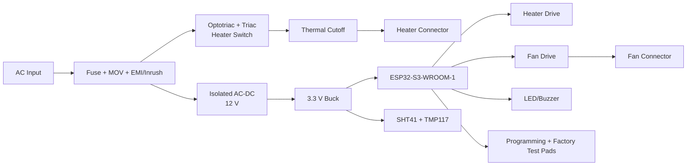

# PCB Design Specification

## Scope

This document defines the production-intent PCB architecture for the Smart Drying & Hygiene System. It is a schematic and layout specification package for a mains-powered ESP32-S3 appliance controller with temperature/humidity sensing, heater switching, fan control, protection circuits, OTA-capable firmware support, and manufacturing test access.

This phase does not replace final CAD capture in KiCad/Altium/OrCAD. It defines the circuit blocks, design constraints, safety boundaries, and layout rules required before CAD implementation.

## Board Assumptions

| Parameter | Baseline |
| --- | --- |
| Board type | Main appliance controller PCB |
| Input | 100-240 VAC, 50/60 Hz, final SKU strategy TBD |
| Logic supply | Isolated 12 V from AC-DC module, then 3.3 V buck |
| MCU | ESP32-S3-WROOM-1-N16R8 |
| Heater switching | Isolated optotriac + triac AC switching, slow-cycle control |
| Fan | BLDC fan/blower with PWM/control and tach feedback preferred |
| Sensors | SHT41 humidity/outlet temperature, TMP117 heater-zone temperature |
| Layers | 4-layer recommended |
| Copper | 1 oz external copper baseline; increase to 2 oz if high-current PCB heater routing is unavoidable |
| Safety | AC and SELV domains separated with creepage/clearance and slots where needed |

## Functional Blocks

## PCB Partitioning

The board shall be physically partitioned into these zones:

| Zone | Contents | Constraints |
| --- | --- | --- |
| AC input zone | Fuse, MOV, line/neutral entry, optional EMI parts | High-voltage spacing, reinforced insulation boundaries. |
| Heater power zone | Triac, snubber, heater connector, thermal cutoff path | High current, heat, high-voltage clearance. |
| Isolated power zone | IRM-10-12 or larger AC-DC module | Follow module datasheet keepout and spacing. |
| Low-voltage power zone | 12 V distribution, 3.3 V buck, optional LDO | Keep switch-node compact; isolate from RF and sensors. |
| MCU/RF zone | ESP32-S3-WROOM-1, boot/reset, status IO | Antenna keepout mandatory. |
| Sensor zone | I2C pullups, sensor connectors or local sensors | Keep away from heater switching and hot copper. |
| Fan/actuator zone | Fan connector, MOSFET/driver, flyback where needed | Route current returns away from sensor ground. |
| Factory test zone | UART/JTAG/USB pads, boot, reset, test points | Bed-of-nails accessible from one side if possible. |

## Recommended 4-Layer Stackup

| Layer | Use |
| --- | --- |
| L1 Top | Components, short signal routes, high-current pours where needed. |
| L2 Inner | Continuous low-voltage ground plane, split/keepout under AC where required. |
| L3 Inner | 3.3 V, 12 V, quiet sensor power, low-speed signals. |
| L4 Bottom | Secondary routing, low-voltage signals, test pads. |

High-voltage AC regions must not use the low-voltage ground plane underneath unless clear insulation strategy is reviewed and approved. Maintain isolation slots or keepouts between primary AC and SELV areas.

## Key Electrical Requirements

- Heater control GPIO must default inactive during reset and boot.
- Add gate/base pull-down or pull-up resistors so all power stages remain off when ESP32 pins are high impedance.
- Place decoupling close to ESP32-S3, sensors, buck regulator, and driver ICs.
- Add I2C pull-up resistors to 3.3 V.
- Protect external low-voltage connectors with ESD/TVS where user-accessible.
- Provide test points for all rails, reset, boot, UART, I2C, fan tach, heater enable, and fault outputs.
- Use keyed connectors or connector positions that prevent heater/fan/sensor mis-plugging.
- Separate heater current from sensor and MCU return currents.

## Preliminary Connector Plan

| Connector | Pins | Signals |
| --- | --- | --- |
| J1 AC input | 2 or 3 | Line, Neutral, Protective Earth if Class I. |
| J2 Heater | 2 | Switched Line/Neutral or heater pair depending on architecture. |
| J3 Fan | 3 or 4 | Fan V+, GND, Tach, PWM/control. |
| J4 Sensor daughterboard | 4 to 6 | 3.3 V, GND, I2C SDA, I2C SCL, optional interrupt, shield/drain. |
| J5 Factory UART | Pads | 3.3 V, GND, TX, RX, EN, BOOT. |
| J6 Optional USB-C service | TBD | USB D+/D-, VBUS sense, GND, CC resistors. |
| J7 UI indicators | 4 to 8 | LED, buzzer, button, optional display signals. |

## PCB Size And Mechanical Notes

- Keep AC connectors and heater connectors close to enclosure cable entry and heater harness.
- Keep ESP32 antenna near board edge and away from metal heater ducts, mains wiring, and large copper.
- Do not place humidity sensor in stagnant air. If the main PCB is not in the airflow path, use a small sensor daughterboard.
- Keep thermal cutoff physically on or near the heater assembly, not only on the control PCB, unless the PCB is mounted at the true risk location.

## Design Review Gates

Before fabrication:

1. Electrical schematic review.
2. Mains isolation and creepage/clearance review.
3. ESP32 antenna placement review.
4. Thermal review for triac, power supply, regulators, and connectors.
5. Manufacturing test access review.
6. DFM review with PCB assembler.
7. Compliance pre-review with target safety standard assumptions.

