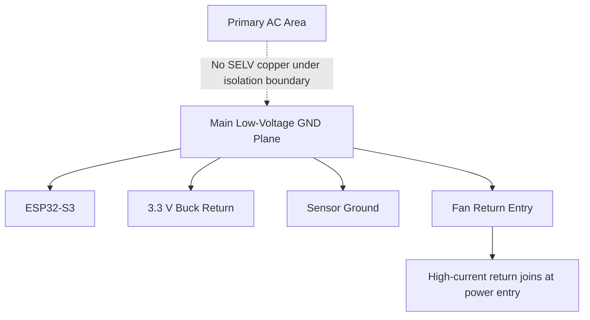

# PCB Layout Guidelines

## Layer Stackup

Recommended stackup:

| Layer | Purpose |
| --- | --- |
| Top | Components, controlled short routes, local power pours. |
| Inner 1 | Low-voltage ground plane. Do not extend under primary AC isolation zones. |
| Inner 2 | 12 V, 3.3 V, sensor rail, low-speed signals. |
| Bottom | Secondary signals, test pads, low-current routing. |

Use 4 layers for better EMC, cleaner RF behavior, lower impedance power distribution, and easier manufacturing test routing.

## Ground Plane Strategy

Rules:

- Use one continuous low-voltage ground plane for ESP32, sensors, and low-voltage power after isolation.
- Keep fan return currents from flowing through sensor ground paths.
- Connect high-current fan ground near the 12 V supply return entry, then to the main ground plane.
- Keep buck regulator hot loop small and return directly to input/output capacitors.
- Do not split ground under ESP32 unless isolation boundaries require copper keepout.
- Do not route low-voltage ground copper under primary AC unless insulation and spacing are reviewed.

## High-Voltage / Low-Voltage Isolation

Minimum design targets before compliance review:

- Maintain at least 6.4 mm creepage/clearance between primary AC and SELV low-voltage domains for universal mains planning.
- Increase spacing where required by final safety standard, pollution degree, material group, altitude, coating, slots, or reinforced insulation needs.
- Use routed slots under optocoupler/AC-DC isolation boundaries if needed.
- Keep silkscreen warnings and clear visual separation between domains.
- Do not place test pads for mains nets near low-voltage fixture pads.

Final creepage and clearance must be reviewed against the actual target standard and certification lab guidance.

## ESP32-S3 RF Layout

- Place ESP32-S3-WROOM-1 at board edge.
- Follow Espressif antenna keepout exactly.
- No copper, traces, planes, battery, metal, heater duct, fan motor, or harness over/under antenna keepout.
- Keep AC and heater wiring away from antenna.
- Provide ground stitching around the module ground area, outside antenna keepout.
- Avoid tall components near antenna.

## Buck Regulator Layout

- Follow TPS54302 datasheet layout closely.
- Keep input capacitor, SW node, diode/internal return path, inductor, and output capacitor compact.
- Keep SW copper small to reduce EMI.
- Keep feedback trace away from SW node.
- Use ground vias near input/output capacitors.
- Keep buck away from humidity sensor and antenna if possible.

## Heater Switching Layout

- Keep triac, snubber, heater connector, and AC routing in the high-voltage power zone.
- Use wide copper and thermal relief appropriate for heater current.
- Provide triac heatsinking copper if board-mounted dissipation requires it.
- Keep optotriac isolation spacing clean.
- Keep heater current loops small and away from ESP32 and sensors.
- Add slots or creepage barriers between triac gate/control and mains where required.
- Do not route sensor or RF traces through heater switching zone.

## Sensor Layout

- Place SHT41 in representative airflow, not behind warm components.
- Avoid copper heat spreading under the humidity sensor if it biases measurement.
- Place TMP117 close to the target heater-zone measurement point while staying within rating.
- If sensors are on a daughterboard, use keyed connector and ESD protection.
- Keep I2C traces short and away from AC/triac switching.
- Add series resistors if I2C exits main board on a harness.

## Fan Layout

- Put fan connector near fan harness exit.
- Use adequate trace width for fan startup current.
- Route tach and PWM away from heater/AC noise.
- Add local bulk capacitance near fan connector.
- Add TVS/ESD if harness is long or user-accessible.
- Keep fan return currents out of sensor ground.

## Test Point Layout

- Put factory pads on one side where possible.
- Use consistent pad size and pitch for bed-of-nails.
- Keep mains test pads physically separate and guarded.
- Label all low-voltage test pads in silkscreen.
- Include fiducials and tooling holes.
- Include board serial/hardware revision marking area.

## Thermal Layout

- Keep heat-generating parts away from humidity sensor and ESP32 antenna.
- Provide copper pour/heatsinking for triac and regulators.
- Avoid placing electrolytic capacitors near heater ducts.
- Keep AC-DC module within its thermal derating.
- Model or test worst-case high ambient, blocked airflow, and max heater operation.

## DFM Rules

- Prefer components with standard SMT packages and good assembly availability.
- Use one-sided assembly if cost target demands it, but maintain test access.
- Avoid placing small passives too close to high-voltage slots or routed cutouts.
- Add fiducials: at least 3 global fiducials plus local fiducials for fine-pitch parts.
- Use clear polarity/orientation marks for diodes, electrolytics, connectors, optocouplers, and triac.
- Keep connector orientation keyed and mechanically supported.

