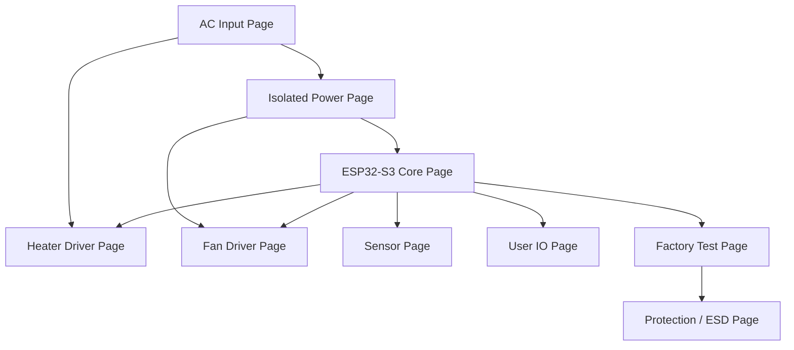
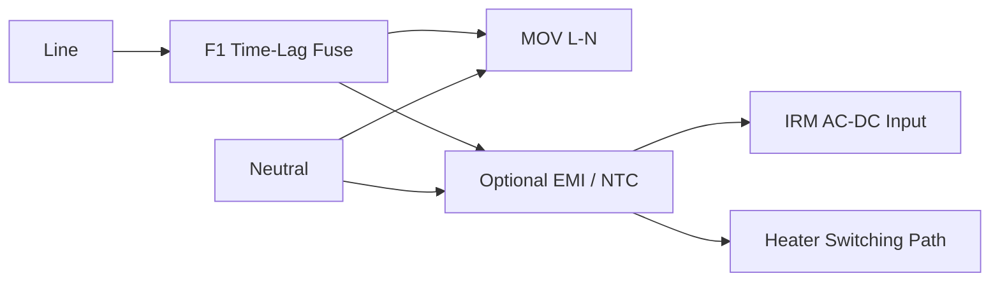
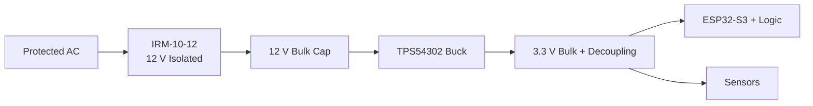
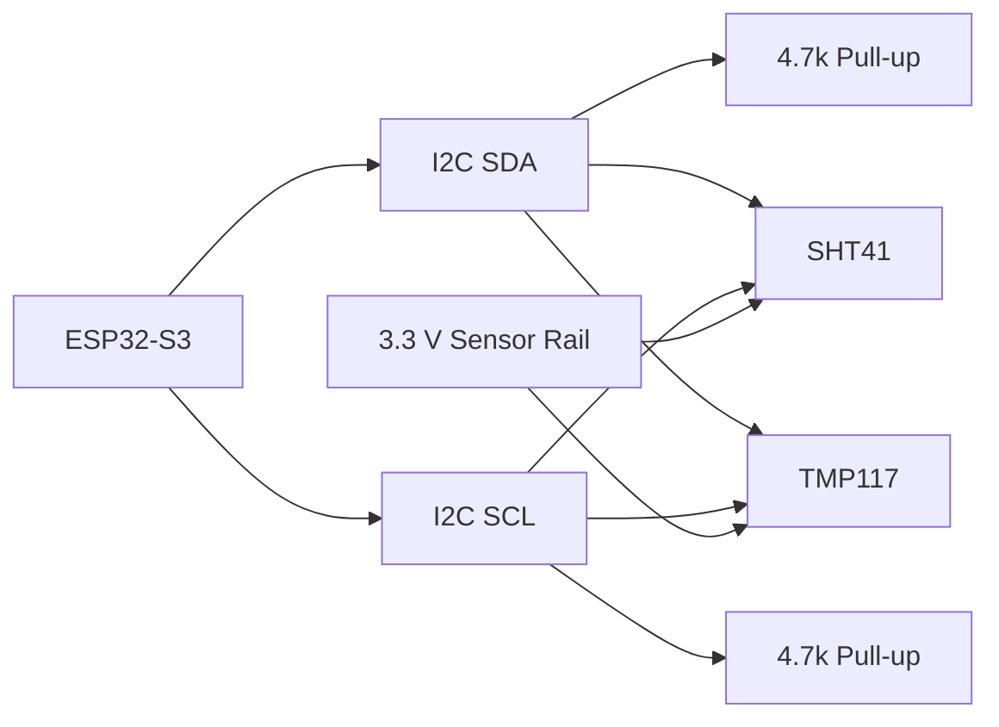
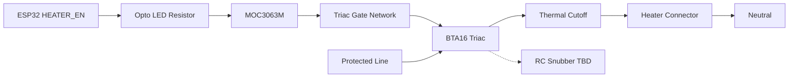
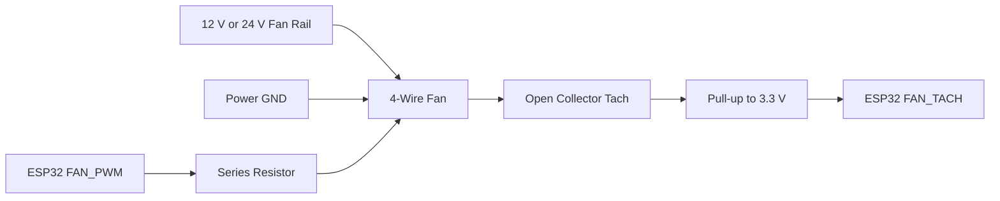

# Schematic Design

## Top-Level Schematic Pages

Recommended CAD schematic hierarchy:

1. `01_top_level`
2. `02_ac_input_protection`
3. `03_isolated_power`
4. `04_esp32_s3_core`
5. `05_sensors`
6. `06_heater_driver`
7. `07_fan_driver`
8. `08_user_io`
9. `09_factory_test_debug`
10. `10_protection_and_esd`

## 01 Top-Level Interconnect

## 02 AC Input And Protection

### Circuit Intent

Accept AC mains, provide fuse protection, surge suppression, optional EMI filtering, and distribute protected AC to the isolated AC-DC module and heater switching path.

### Baseline Circuit

### Components

| Ref | Part | Value / Type | Notes |
| --- | --- | --- | --- |
| F1 | Bel 5HT/5HTP | Current TBD | Size after heater wattage selection. |
| RV1 | Littelfuse V14E275P | 275 VAC MOV | For 230 V/universal planning; final rating by region. |
| TH1 | NTC inrush limiter | TBD | Optional depending on AC-DC/heater inrush. |
| CX1 | X2 safety capacitor | TBD | Only if EMI filter required. |
| L1 | Common-mode choke | TBD | Only if EMC pre-scan requires. |

### Design Rules

- Use safety-rated X/Y capacitors only in mains filter positions.
- Keep line and neutral spacing consistent with target voltage and pollution degree.
- MOV should be downstream of fuse so sustained MOV failure is fuse-protected.
- Label high-voltage nets clearly in CAD.

## 03 Isolated Power Section

### Circuit Intent

Generate isolated low-voltage power for control electronics.

### Baseline Circuit

### Components

| Ref | Part | Value / Type | Notes |
| --- | --- | --- | --- |
| U1 | IRM-10-12 | 12 V, 10 W AC-DC | Increase to IRM-20/30 if fan power requires. |
| U2 | TPS54302DDCR | 3.3 V buck | Use datasheet reference layout closely. |
| L2 | Buck inductor | TBD by TI design equations | Saturation current above peak switch current. |
| CIN/COUT | Ceramic/bulk caps | TBD | Low ESR, voltage margin. |
| U3 | AP2112K-3.3 | Optional sensor LDO | Populate if sensor rail isolation is useful. |

### Decoupling

- ESP32-S3 module 3.3 V input: local 10 uF plus 0.1 uF near module pins.
- Buck regulator input/output: per TI datasheet reference.
- Sensor rail: 0.1 uF at each sensor and optional 1 uF local bulk.
- Fan rail: bulk capacitance near fan connector if fan supply is switched.

## 04 ESP32-S3 Core

### Circuit Intent

Provide the main controller, boot/reset support, programming access, RF keepout, and all low-voltage control interfaces.

### Required Circuits

| Circuit | Requirement |
| --- | --- |
| EN reset | Pull-up, reset button/test pad, RC per Espressif guidance. |
| BOOT strapping | Pull-up/down per Espressif guidance and factory access. |
| UART programming | TX, RX, EN, BOOT available on test pads. |
| USB optional | Route D+/D- as differential pair if included. |
| Antenna | Follow module antenna keepout exactly. |
| Decoupling | Local 10 uF and 0.1 uF near 3.3 V module supply. |

### Proposed GPIO Allocation

| Function | Signal | Notes |
| --- | --- | --- |
| I2C SDA | `SENSOR_SDA` | SHT41, TMP117. |
| I2C SCL | `SENSOR_SCL` | 3.3 V pull-ups. |
| Heater enable | `HEATER_EN` | Must default inactive with external pull-down. |
| Heater zero-cross optional | `ZC_DETECT` | Optional for future AC timing diagnostics. |
| Fan PWM | `FAN_PWM` | 25 kHz capable if 4-wire fan requires. |
| Fan tach | `FAN_TACH` | Interrupt-capable input with pull-up. |
| Status LED | `LED_STATUS` | Current-limited. |
| Fault LED | `LED_FAULT` | Current-limited. |
| Buzzer | `BUZZER_EN` | Via transistor/MOSFET. |
| Button | `BTN_USER` | Debounced in firmware, ESD if external. |
| UART TX/RX | `UART0_TX/RX` | Factory programming. |

Final GPIOs must avoid ESP32-S3 strapping-pin conflicts and respect boot behavior.

## 05 Sensor Section

### Circuit Intent

Measure humidity, outlet/exhaust temperature, and heater-zone temperature.

### Baseline Circuit

### Components

| Ref | Part | Value / Type | Notes |
| --- | --- | --- | --- |
| U4 | SHT41-AD1B-R2 | I2C RH/temp | Airflow outlet or exhaust. |
| U5 | TMP117AIDRVR | I2C temp | Heater-zone or safety temperature. |
| R_SDA/R_SCL | Pull-ups | 4.7 k typical | Adjust for bus capacitance. |
| C_SENSOR | Decoupling | 0.1 uF each sensor | Place close to VDD/GND. |
| D_ESD | TVS array | TBD | Use if sensor is on external harness. |

### Notes

- If sensors are on a daughterboard, add ESD and series resistors on I2C lines.
- Keep I2C harness short. If long harness is unavoidable, consider lower pull-up value, bus buffer, or differential sensor interface.
- Humidity sensor should be protected from lint and liquid droplets.

## 06 Heater Driver Section

### Circuit Intent

Switch AC heater power using optically isolated triac drive with independent thermal cutoff.

### Baseline Circuit

### Components

| Ref | Part | Value / Type | Notes |
| --- | --- | --- | --- |
| U6 | MOC3063M | Zero-cross optotriac | Isolated control from ESP32. |
| Q1 | BTA16-600BW/800BW | Triac | Voltage by AC region and surge margin. |
| R_OPTO | LED resistor | TBD | Size for ESP32 GPIO current and optotriac trigger. |
| R_GATE | Gate resistor | Per datasheet/application | Validate trigger current. |
| RC_SNUB | Snubber | TBD | Based on heater load and EMI testing. |
| TF1 | Thermal cutoff | Tf TBD | In series with heater power. |

### Safety Rules

- Heater path must be off when `HEATER_EN` is low or ESP32 reset/high impedance.
- Use optoisolation and maintain isolation spacing.
- Place thermal cutoff physically near the heater risk location.
- Add copper/thermal design for triac dissipation.
- Do not route heater current under ESP32 or sensors.
- Provide test access to `HEATER_EN` without exposing mains.

## 07 Fan Driver Section

### Preferred 4-Wire BLDC Fan Circuit

### Components

| Ref | Part | Value / Type | Notes |
| --- | --- | --- | --- |
| J3 | Fan connector | 4-pin keyed | V+, GND, Tach, PWM. |
| R_PWM | Series resistor | 100 to 330 ohm typical | Damps edge/ringing. |
| R_TACH | Pull-up | 4.7 k to 10 k | Depends fan tach output. |
| C_FAN | Bulk cap | TBD | Near connector for startup transients. |
| D_TVS | TVS | TBD | If fan harness is long or user-accessible. |

### Alternative Switched Fan Supply

For a 2-wire/3-wire fan, add an appropriately rated MOSFET or high-side switch. Do not PWM the supply unless fan vendor allows it.

## 08 User IO

Recommended minimum:

- Power/status LED.
- Active heat indicator LED.
- Fault LED.
- Optional buzzer.
- Optional start/stop button.

All external buttons and indicator harnesses need ESD protection if user-accessible.

## 09 Factory Test And Debug

### Required Test Pads

| Test Point | Purpose |
| --- | --- |
| TP_12V | Verify isolated supply. |
| TP_3V3 | Verify logic rail. |
| TP_GND | Fixture ground. |
| TP_TXD / TP_RXD | UART programming/logging. |
| TP_EN | ESP32 reset. |
| TP_BOOT | Download mode. |
| TP_SDA / TP_SCL | Sensor bus debug. |
| TP_HEATER_EN | Heater command debug. |
| TP_FAN_PWM | Fan command debug. |
| TP_FAN_TACH | Fan feedback debug. |

### Factory Mode

Fixture should be able to:

- Power board safely.
- Flash firmware.
- Read serial number/hardware revision.
- Verify sensors.
- Toggle low-voltage outputs.
- Verify fan control/feedback.
- Verify heater control signal without energizing full heater power unless in appliance-level safety fixture.

## 10 Protection And ESD

Protection shall include:

- MOV on AC input after fuse.
- ESD protection on USB/service connector if included.
- ESD/TVS on external sensor/fan/UI harnesses if user-accessible or long.
- Flyback diode or clamp for relay coils if relay is added.
- RC snubber/MOV/TVS around inductive or noisy loads as validation requires.
- Series resistors on exposed GPIO signal lines where appropriate.

