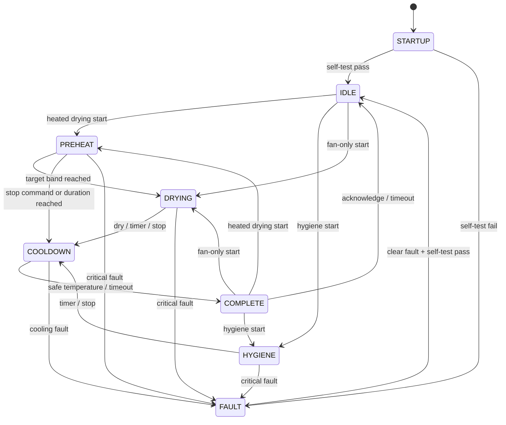
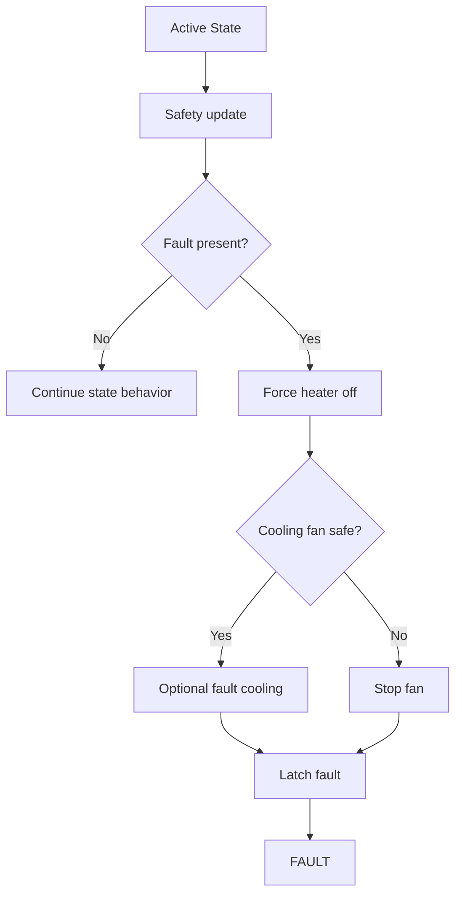

# State Machine Specification

## Purpose

The firmware state machine is the single authority for operating state. It owns all transitions between startup, idle, drying, hygiene, cooldown, complete, and fault behavior. Connectivity modules, buttons, OTA, and factory test commands submit requests to the state machine; they do not directly drive heater or fan outputs.

The safety manager remains the authority for heater permission. The state machine may request heat, but heat is applied only when safety permits it.

## States

| State | Meaning | Heater | Fan | Exit Conditions |
| --- | --- | --- | --- | --- |
| `STARTUP` | Boot, configuration load, self-test. | Off | Off | Self-test pass to `IDLE`; fail to `FAULT`. |
| `IDLE` | Ready for user command. | Off | Off | Start command to `PREHEAT`, `DRYING`, or `HYGIENE`. |
| `PREHEAT` | Fan running, heater ramps toward target. | Regulated | Program target | Target band reached to `DRYING`; timeout or complete to `COOLDOWN`; fault to `FAULT`. |
| `DRYING` | Main drying cycle. | Regulated or off for fan-only | Program target | Timer, humidity dry, stop command, or fault. |
| `HYGIENE` | Elevated-temperature hygiene refresh. | Regulated | Program target | Timer complete, stop command, or fault. |
| `COOLDOWN` | Heater off, fan removes residual heat. | Off | Cooldown target | Outlet temperature below safe threshold or cooldown timeout. |
| `COMPLETE` | Cycle finished. | Off | Off | User acknowledgment or timeout to `IDLE`; start command allowed. |
| `FAULT` | Safety or system fault. | Off | Off or safety-selected cooling if safe | Fault clear plus self-test pass to `IDLE`. |

## State Diagram

## Command Handling

| Command | Allowed States | Behavior |
| --- | --- | --- |
| Start program | `IDLE`, `COMPLETE` | Validates profile and safety, then transitions to requested operating state. |
| Stop cycle | `PREHEAT`, `DRYING`, `HYGIENE` | Enters `COOLDOWN` if heater was enabled, otherwise `COMPLETE`. |
| Clear fault | `FAULT` | Clears fault only if self-test passes. |
| Factory reset | `IDLE`, `FAULT` | Clears settings through storage manager, then reboots or returns to startup flow. |
| OTA request | `IDLE`, `COMPLETE` | Allowed only when heater is off and no active cycle is running. |

## Program Profiles

| Program | Target Temp | Fan | Default Duration | Max Duration | Humidity Auto Stop |
| --- | --- | --- | --- | --- | --- |
| Shoes | 50 C | 80% | 120 min | 240 min | Yes |
| Helmet | 42 C | 60% | 60 min | 120 min | Yes |
| Gloves | 45 C | 70% | 90 min | 180 min | Yes |
| Sports Gear | 55 C | 90% | 180 min | 360 min | Yes |
| Technical Gear | 38 C | 50% | 90 min | 240 min | Yes |
| Clothing | 45 C | 70% | 120 min | 300 min | Yes |
| Hygiene | 62 C | 80% | 45 min | 90 min | No |
| Fan Only | Heater off | 70% | 60 min | 480 min | Optional |

## Safety Rules

- Any critical fault immediately transitions to `FAULT`.
- Heater is disabled in `STARTUP`, `IDLE`, `COOLDOWN`, `COMPLETE`, and `FAULT`.
- Fan must be running before heater is requested in heated states.
- `HYGIENE` never exceeds its configured maximum duration.
- `COOLDOWN` always disables heater before commanding fan.
- Stale or invalid temperature sensing prevents heater operation.
- Fan feedback failure prevents heater operation.
- Stop command never turns heater off without considering cooldown.

## Humidity Completion Logic

Initial production baseline:

- Minimum active drying time: 15 minutes.
- Dry threshold: RH at or below 35%.
- Hold requirement: dry threshold must be met for at least 5 consecutive control ticks.
- Future refinement: use humidity drop rate, inlet compensation, item model, and adaptive prediction.

## Fault Handling

## App-Facing Status

The state machine status object shall expose:

- Current state.
- Current program.
- Fault code.
- Elapsed seconds.
- Remaining seconds.
- Outlet temperature.
- Relative humidity.
- Fan target percentage.
- Heater active flag.
- Completion reason when in `COMPLETE`.

