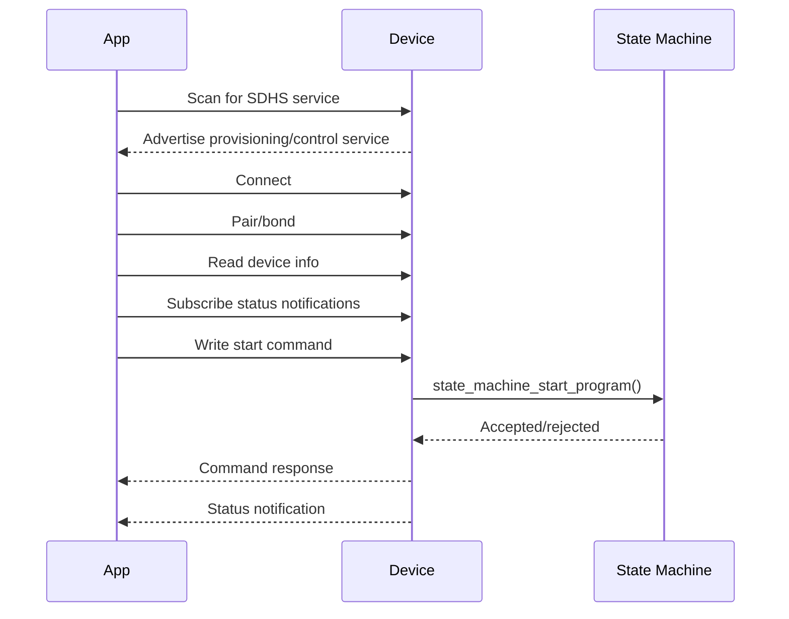
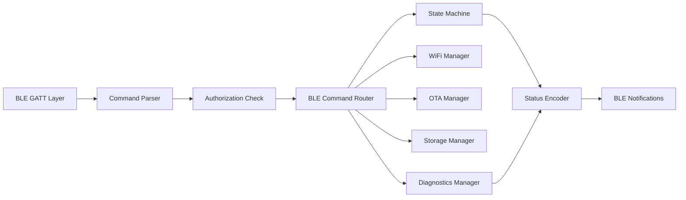

# BLE Architecture

## Purpose

BLE provides nearby control, first-time onboarding, WiFi provisioning, diagnostics, and recovery access. The device must remain useful over BLE even when WiFi is unavailable.

BLE commands are not allowed to directly control heater or fan GPIO. BLE writes are parsed into internal commands and submitted to the state machine, safety manager, storage manager, WiFi manager, or OTA manager.

## BLE Roles

| Role | Device Behavior |
| --- | --- |
| Peripheral | Smart drying device advertises and hosts GATT services. |
| Central | Flutter mobile app scans, connects, pairs, writes commands, and subscribes to status. |

## Advertising

| Field | Value |
| --- | --- |
| Local name | `SDHS-XXXXXX`, where suffix is derived from device ID. |
| Primary service UUID | `7b6a0001-5f4d-4f7a-9b6d-3b0c7d9f1000` |
| Connectable | Yes |
| Pairing required for control | Yes |
| Provisioning mode | Advertise until claimed or after factory reset. |

## BLE Security

- Require pairing/bonding for start/stop, configuration, WiFi provisioning, OTA, and diagnostics history.
- Allow limited unauthenticated reads for device identity and provisioning status only.
- Reject privileged writes from unbonded centrals.
- Store bond state in NVS.
- Factory reset clears BLE bonds.

## Connection Flow

## BLE Firmware Architecture

## Supported BLE Functions

- Device ON/OFF represented as start/stop cycle commands.
- Fan speed target through custom cycle command.
- Temperature status reporting.
- Humidity status reporting.
- Program selection.
- State/status reporting.
- WiFi provisioning.
- OTA trigger/recovery coordination.
- Diagnostics fault readout.

## Data Encoding

Initial firmware uses compact binary payloads for embedded reliability. The mobile app can wrap these in typed Dart models.

Multi-byte integers are little-endian. Temperatures are encoded as signed centi-degrees Celsius unless otherwise noted. Humidity is encoded as centi-percent RH.

