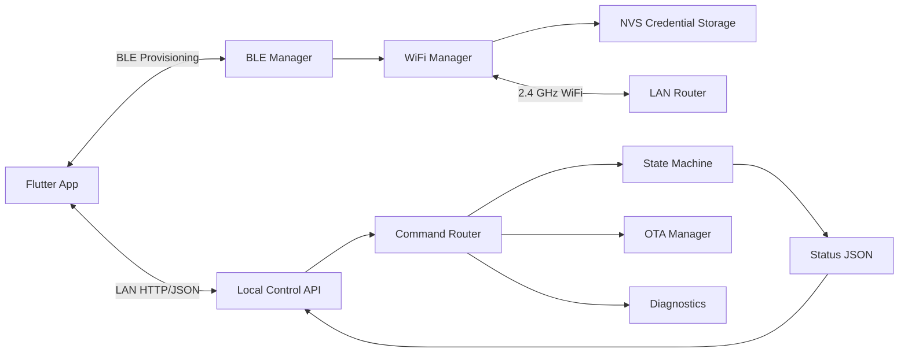
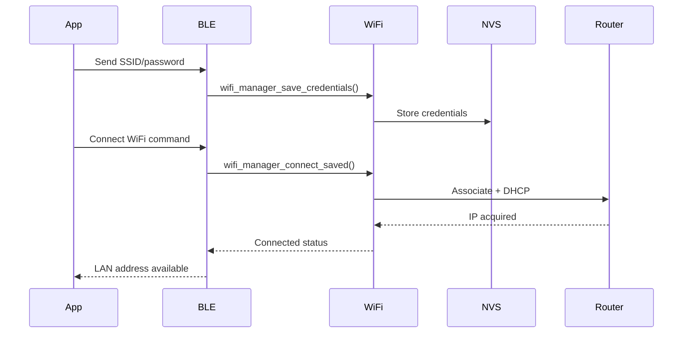

# WiFi Architecture

## Purpose

WiFi provides local network control, OTA firmware update transport, time synchronization, diagnostics access, and a future path to optional cloud integration. The product must still perform core drying and safety functions without WiFi or internet.

## Requirements

- Support 2.4 GHz WiFi station mode.
- Receive WiFi credentials through authenticated BLE provisioning.
- Store credentials in NVS.
- Reconnect automatically after reboot or temporary network loss.
- Expose local device status and control API on the LAN.
- Support OTA download transport.
- Never allow WiFi commands to bypass the firmware state machine or safety manager.
- Reject OTA while a cycle is active.

## WiFi Modes

| Mode | Purpose |
| --- | --- |
| Unprovisioned | BLE remains available for setup; WiFi disconnected. |
| Provisioned Disconnected | Credentials stored but network unavailable. |
| Connecting | Station mode attempting connection. |
| Connected | LAN control and OTA transport available. |
| Recovery | BLE can update credentials or factory reset after repeated failures. |

## Architecture Diagram

## Provisioning Flow

## Local Control Strategy

The initial LAN API is HTTP/JSON over the local network. It is simple to test, easy for Flutter to consume, and adequate for same-network control. The command layer shall later support token-based authorization and request signing if cloud or remote access is added.

Initial endpoints:

- `GET /api/v1/status`
- `POST /api/v1/cycle/start`
- `POST /api/v1/cycle/stop`
- `POST /api/v1/fault/clear`
- `GET /api/v1/device`
- `GET /api/v1/ota/status`
- `POST /api/v1/ota/start`

## Security Baseline

- WiFi credentials are provisioned only over paired BLE.
- Local API accepts commands only after the device is provisioned.
- Production release must add an app/device pairing token to LAN requests.
- OTA URLs and manifests must be validated in Phase 9.
- Debug endpoints are disabled in production builds.

## Failure Handling

| Failure | Behavior |
| --- | --- |
| Wrong password | Report provisioning failure over BLE and status API. |
| Router unavailable | Retry with backoff; BLE remains available. |
| IP lost | Reconnect and keep local cycle running. |
| WiFi stack error | Restart WiFi manager without rebooting active control loop where possible. |
| Repeated failures | Enter recovery-provisioning indication; keep credentials until user clears. |

## Future Cloud Integration

Cloud remains optional. If added, cloud commands must use the same internal command router and must not directly control heater or fan outputs.

