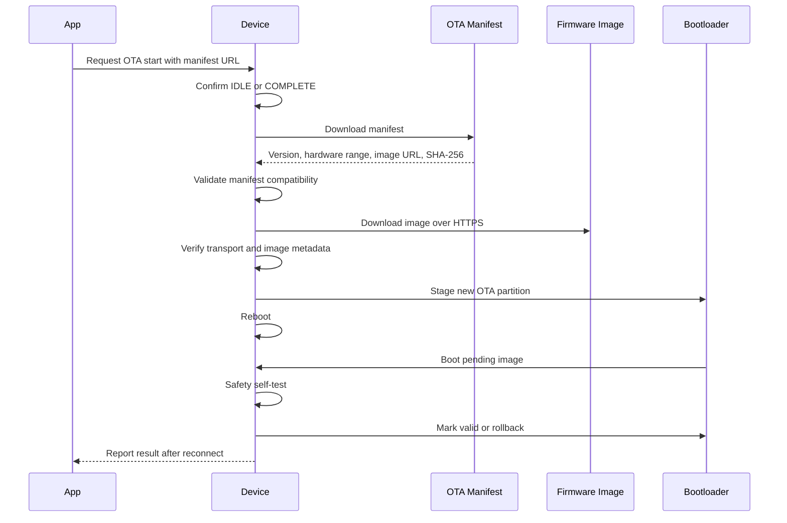
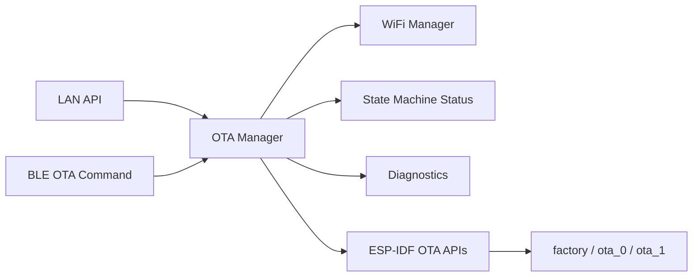

# OTA Architecture

## Purpose

The OTA system updates device firmware safely over WiFi without risking a bricked appliance. It supports version management, manifest-based update metadata, integrity checks, rollback, recovery status, and strict blocking of OTA during active heating or cooldown.

## ESP-IDF OTA Basis

The firmware uses ESP-IDF OTA partitions and rollback support. Espressif documents that rollback-capable images boot in a pending verification state and must be marked valid after diagnostics pass using `esp_ota_mark_app_valid_cancel_rollback()`. If self-test fails, firmware should call `esp_ota_mark_app_invalid_rollback_and_reboot()` to roll back. Sources: [ESP-IDF OTA docs](https://documentation.espressif.com/projects/esp-idf/en/latest/esp32/api-reference/system/ota.html) and [ESP HTTPS OTA docs](https://docs.espressif.com/projects/esp-idf/en/v5.4.2/esp32/api-reference/system/esp_https_ota.html).

## OTA Flow

## OTA States

| State | Meaning |
| --- | --- |
| `IDLE` | No update in progress. |
| `CHECKING` | Manifest being fetched or validated. |
| `DOWNLOADING` | Firmware image download in progress. |
| `VERIFYING` | Image and metadata are being checked. |
| `PENDING_REBOOT` | Image staged and reboot required. |
| `VALIDATING_BOOT` | New image booted and running self-test. |
| `SUCCESS` | New firmware marked valid. |
| `FAILED` | Update failed before reboot. |
| `ROLLBACK` | New image failed validation and rollback was requested. |

## Safety Rules

- OTA can start only in `IDLE` or `COMPLETE`.
- OTA start is rejected in `STARTUP`, `PREHEAT`, `DRYING`, `HYGIENE`, `COOLDOWN`, or `FAULT`.
- Heater must be off before OTA download begins.
- OTA shall not erase NVS credentials or fault history.
- OTA shall not mark a new image valid until firmware self-test passes.
- Failed OTA shall leave the previous app bootable.

## Security And Integrity

Initial implementation:

- Manifest includes expected firmware version, hardware compatibility, image URL, byte size, and SHA-256.
- HTTPS transport is required for production.
- Device rejects manifest hardware mismatch.
- Device rejects same or older version unless forced by factory/debug build.

Production hardening before release:

- Signed manifest using offline release key.
- Certificate pinning or bundled trusted CA certificate.
- Secure boot and flash encryption strategy.
- Anti-rollback secure version if product threat model requires it.

## Firmware Integration

